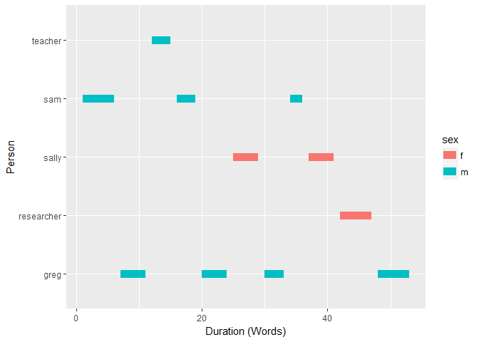

textshape   
============

**textshape** is small suite of text reshaping and restructuring
functions. Many of these functions are descended from tools in the
[**qdapTools**](https://github.com/trinker/qdapTools) package. This
brings reshaping tools under one roof with specific functionality of the
package limited to text reshaping.

Table of Contents
============

-   [Functions](#functions)
-   [Installation](#installation)
-   [Contact](#contact)
-   [Examples](#examples)
-   [Loading Dependencies](#loading-dependencies)
    -   [Tidying](#tidying)
        -   [A Vector](#a-vector)
        -   [A Dataframe](#a-dataframe)
        -   [A Named Vector](#a-named-vector)
        -   [A Table](#a-table)
        -   [A DocumentTermMatrix](#a-documenttermmatrix)
        -   [A DocumentTermMatrix of Collocations](#a-documenttermmatrix-of-collocations)
    -   [Combining](#combining)
        -   [A Vector](#a-vector-1)
        -   [A Dataframe](#a-dataframe-1)
    -   [Tabulating](#tabulating)
        -   [A Vector](#a-vector-2)
        -   [A Dataframe](#a-dataframe-2)
    -   [Spanning](#spanning)
        -   [A Vector](#a-vector-3)
        -   [A Dataframe](#a-dataframe-3)
        -   [Gantt Plot](#gantt-plot)
    -   [Splitting](#splitting)
        -   [Indices](#indices)
        -   [Matches](#matches)
        -   [Portions](#portions)
        -   [Runs](#runs)
        -   [Sentences](#sentences)
        -   [Speakers](#speakers)
        -   [Tokens](#tokens)
        -   [Transcript](#transcript)
        -   [Words](#words)
    -   [Putting It Together](#putting-it-together)

Functions
============

Most of the functions split, expand, or tidy a `vector`, `list`,
`data.frame`, or `DocumentTermMatrix`. The `combine`, `duration`, &
`mtabulate` functions are notable exceptions. The table below describes
the functions and their use:

<table style="width:160%;">
<colgroup>
<col width="26%" />
<col width="45%" />
<col width="87%" />
</colgroup>
<thead>
<tr class="header">
<th align="left">Function</th>
<th align="left">Used On</th>
<th align="left">Description</th>
</tr>
</thead>
<tbody>
<tr class="odd">
<td align="left"><code>combine</code></td>
<td align="left"><code>vector</code>, <code>list</code>, <code>data.frame</code></td>
<td align="left">Combine and collapse elements</td>
</tr>
<tr class="even">
<td align="left"><code>tidy_list</code></td>
<td align="left"><code>list</code> of <code>vector</code>s or <code>data.frame</code>s</td>
<td align="left">Row bind a list and repeat list names as id column</td>
</tr>
<tr class="odd">
<td align="left"><code>tidy_vector</code></td>
<td align="left"><code>vector</code></td>
<td align="left">Column bind a named atomic <code>vector</code>'s names and values</td>
</tr>
<tr class="even">
<td align="left"><code>tidy_table</code></td>
<td align="left"><code>table</code></td>
<td align="left">Column bind a <code>table</code>'s names and values</td>
</tr>
<tr class="odd">
<td align="left"><code>tidy_dtm</code>/<code>tidy_tdm</code></td>
<td align="left"><code>DocumentTermMatrix</code></td>
<td align="left">Tidy format <code>DocumentTermMatrix</code>/<code>TermDocumentMatrix</code></td>
</tr>
<tr class="even">
<td align="left"><code>tidy_colo_dtm</code>/<code>tidy_colo_tdm</code></td>
<td align="left"><code>DocumentTermMatrix</code></td>
<td align="left">Tidy format of collocating words from a <code>DocumentTermMatrix</code>/<code>TermDocumentMatrix</code></td>
</tr>
<tr class="odd">
<td align="left"><code>duration</code></td>
<td align="left"><code>vector</code>, <code>data.frame</code></td>
<td align="left">Get duration (start-end times) for turns of talk in n words</td>
</tr>
<tr class="even">
<td align="left"><code>from_to</code></td>
<td align="left"><code>vector</code>, <code>data.frame</code></td>
<td align="left">Prepare speaker data for a flow network</td>
</tr>
<tr class="odd">
<td align="left"><code>mtabulate</code></td>
<td align="left"><code>vector</code>, <code>list</code>, <code>data.frame</code></td>
<td align="left">Dataframe/list version of <code>tabulate</code> to produce count matrix</td>
</tr>
<tr class="even">
<td align="left"><code>split_index</code></td>
<td align="left"><code>vector</code>, <code>list</code>, <code>data.frame</code></td>
<td align="left">Split at specified indices</td>
</tr>
<tr class="odd">
<td align="left"><code>split_match</code></td>
<td align="left"><code>vector</code></td>
<td align="left">Split vector at specified character/regex match</td>
</tr>
<tr class="even">
<td align="left"><code>split_portion</code></td>
<td align="left"><code>vector</code>*</td>
<td align="left">Split data into portioned chunks</td>
</tr>
<tr class="odd">
<td align="left"><code>split_run</code></td>
<td align="left"><code>vector</code>, <code>data.frame</code></td>
<td align="left">Split runs (e.g., &quot;aaabbbbcdddd&quot;)</td>
</tr>
<tr class="even">
<td align="left"><code>split_sentence</code></td>
<td align="left"><code>vector</code>, <code>data.frame</code></td>
<td align="left">Split sentences</td>
</tr>
<tr class="odd">
<td align="left"><code>split_speaker</code></td>
<td align="left"><code>data.frame</code></td>
<td align="left">Split combined speakers (e.g., &quot;Josh, Jake, Jim&quot;)</td>
</tr>
<tr class="even">
<td align="left"><code>split_token</code></td>
<td align="left"><code>vector</code>, <code>data.frame</code></td>
<td align="left">Split words and punctuation</td>
</tr>
<tr class="odd">
<td align="left"><code>split_transcript</code></td>
<td align="left"><code>vector</code></td>
<td align="left">Split speaker and dialogue (e.g., &quot;greg: Who me&quot;)</td>
</tr>
<tr class="even">
<td align="left"><code>split_word</code></td>
<td align="left"><code>vector</code>, <code>data.frame</code></td>
<td align="left">Split words</td>
</tr>
<tr class="odd">
<td align="left"><code>column_to_rownames</code></td>
<td align="left"><code>data.frame</code></td>
<td align="left">Add a column as rownames</td>
</tr>
</tbody>
</table>

\****Note:*** *Text vector accompanied by aggregating `grouping.var`
argument, which can be in the form of a `vector`, `list`, or
`data.frame`*

Installation
============

To download the development version of **textshape**:

Download the [zip
ball](https://github.com/trinker/textshape/zipball/master) or [tar
ball](https://github.com/trinker/textshape/tarball/master), decompress
and run `R CMD INSTALL` on it, or use the **pacman** package to install
the development version:

    if (!require("pacman")) install.packages("pacman")
    pacman::p_load_gh("trinker/textshape")

Contact
=======

You are welcome to:    
- submit suggestions and bug-reports at: <https://github.com/trinker/textshape/issues>    
- send a pull request on: <https://github.com/trinker/textshape/>    
- compose a friendly e-mail to: <tyler.rinker@gmail.com>    

Examples
========

The main shaping functions can be broken into the categories of (a)
binding, (b) combining, (c) tabulating, (d) spanning, (e) splitting, &
(f) tidying. The majority of functions in **textshape** fall into the
category of splitting and expanding (the semantic opposite of
combining). These sections will provide example uses of the functions
from **textshape** within the three categories.

Loading Dependencies
====================

    if (!require("pacman")) install.packages("pacman")
    pacman::p_load(tidyverse, magrittr, ggstance)
    pacman::p_load_current_gh('trinker/gofastr', 'trinker/textshape')

Tidying
-------

The `tidy_xxx` functions convert untidy structures into [tidy
format](https://www.jstatsoft.org/article/view/v059i10). Tidy formatted
text data structures are particularly useful for interfacing with
**ggplot2**, which expects this form.

The `tidy_list` function is used in the style of
`do.call(rbind, list(x1, x2))` as a convenient way to bind together
multiple named `data.frame`s or `vectors`s into a single `data.frame`
with the `list` `names` acting as an id column. The `data.frame` bind is
particularly useful for binding transcripts from different observations.
Additionally, `tidy_vector` and `tidy_table` are provided for `cbinding`
a `table`'s or named atomic `vector`'s values and names as separate
columns in a `data.frame`. Lastly, `tidy_dtm`/`tidy_tdm` provide
convenient ways to tidy a `DocumentTermMatrix` or `TermDocumentMatrix`.

#### A Vector

    x <- list(p=1:500, r=letters)
    tidy_list(x)

    ## # A tibble: 526 x 2
    ##       id content
    ##    <chr>   <chr>
    ## 1      p       1
    ## 2      p       2
    ## 3      p       3
    ## 4      p       4
    ## 5      p       5
    ## 6      p       6
    ## 7      p       7
    ## 8      p       8
    ## 9      p       9
    ## 10     p      10
    ## # ... with 516 more rows

#### A Dataframe

    x <- list(p=mtcars, r=mtcars, z=mtcars, d=mtcars)
    tidy_list(x) 

    ## # A tibble: 128 x 12
    ##       id   mpg   cyl  disp    hp  drat    wt  qsec    vs    am  gear  carb
    ##    <chr> <dbl> <dbl> <dbl> <dbl> <dbl> <dbl> <dbl> <dbl> <dbl> <dbl> <dbl>
    ## 1      p  21.0     6 160.0   110  3.90 2.620 16.46     0     1     4     4
    ## 2      p  21.0     6 160.0   110  3.90 2.875 17.02     0     1     4     4
    ## 3      p  22.8     4 108.0    93  3.85 2.320 18.61     1     1     4     1
    ## 4      p  21.4     6 258.0   110  3.08 3.215 19.44     1     0     3     1
    ## 5      p  18.7     8 360.0   175  3.15 3.440 17.02     0     0     3     2
    ## 6      p  18.1     6 225.0   105  2.76 3.460 20.22     1     0     3     1
    ## 7      p  14.3     8 360.0   245  3.21 3.570 15.84     0     0     3     4
    ## 8      p  24.4     4 146.7    62  3.69 3.190 20.00     1     0     4     2
    ## 9      p  22.8     4 140.8    95  3.92 3.150 22.90     1     0     4     2
    ## 10     p  19.2     6 167.6   123  3.92 3.440 18.30     1     0     4     4
    ## # ... with 118 more rows

#### A Named Vector

    x <- setNames(
        sample(LETTERS[1:6], 1000, TRUE), 
        sample(state.name[1:5], 1000, TRUE)
    )
    tidy_vector(x)

    ## # A tibble: 1,000 x 2
    ##            id content
    ##         <chr>   <chr>
    ## 1    Arkansas       E
    ## 2  California       A
    ## 3     Alabama       B
    ## 4    Arkansas       A
    ## 5     Alabama       E
    ## 6     Arizona       A
    ## 7     Alabama       E
    ## 8    Arkansas       C
    ## 9     Alabama       D
    ## 10    Alabama       B
    ## # ... with 990 more rows

#### A Table

    x <- table(sample(LETTERS[1:6], 1000, TRUE))
    tidy_table(x)

    ## # A tibble: 6 x 2
    ##      id content
    ##   <chr>   <int>
    ## 1     A     173
    ## 2     B     175
    ## 3     C     148
    ## 4     D     184
    ## 5     E     154
    ## 6     F     166

#### A DocumentTermMatrix

The `tidy_dtm` and `tidy_tdm` functions convert a `DocumentTermMatrix`
or `TermDocumentMatrix` into a tidied data set.

    my_dtm <- with(presidential_debates_2012, q_dtm(dialogue, paste(time, tot, sep = "_")))

    tidy_dtm(my_dtm) %>%
        tidyr::extract(doc, c("time", "turn", "sentence"), "(\\d)_(\\d+)\\.(\\d+)") %>%
        mutate(
            time = as.numeric(time),
            turn = as.numeric(turn),
            sentence = as.numeric(sentence)
        ) %>%
        tbl_df() %T>%
        print() %>%
        group_by(time, term) %>%
        summarize(n = sum(n)) %>%
        group_by(time) %>%
        arrange(desc(n)) %>%
        slice(1:10) %>%
        mutate(term = factor(paste(term, time, sep = "__"), levels = rev(paste(term, time, sep = "__")))) %>%
        ggplot(aes(x = n, y = term)) +
            geom_barh(stat='identity') +
            facet_wrap(~time, ncol=2, scales = 'free_y') +
            scale_y_discrete(labels = function(x) gsub("__.+$", "", x))

    ## # A tibble: 42,057 x 7
    ##     time  turn sentence         term     n     i     j
    ##    <dbl> <dbl>    <dbl>        <chr> <dbl> <int> <int>
    ## 1      1     1        1        we'll     1     1     1
    ## 2      1     1        1         talk     1     1     2
    ## 3      1     1        1        about     2     1     3
    ## 4      1     1        1 specifically     1     1     4
    ## 5      1     1        1       health     1     1     5
    ## 6      1     1        1         care     1     1     6
    ## 7      1     1        1           in     1     1     7
    ## 8      1     1        1            a     1     1     8
    ## 9      1     1        1       moment     1     1     9
    ## 10     1     1        1            .     1     1    10
    ## # ... with 42,047 more rows

#### A DocumentTermMatrix of Collocations

The `tidy_colo_dtm` and `tidy_colo_tdm` functions convert a
`DocumentTermMatrix` or `TermDocumentMatrix` into a collocation matrix
and then a tidied data set.

    my_dtm <- with(presidential_debates_2012, q_dtm(dialogue, paste(time, tot, sep = "_")))

    tidy_colo_dtm(my_dtm) %>%
        tbl_df() %>%
        filter(!term_1 %in% c('i', lexicon::sw_onix) & !term_2 %in% lexicon::sw_onix) %>%
        filter(term_1 != term_2) %>%
        unique_pairs() %>%
        filter(n > 15) %>%
        complete(term_1, term_2, fill = list(n = 0)) %>%
        ggplot(aes(x = term_1, y = term_2, fill = n)) +
            geom_tile() +
            scale_fill_gradient(low= 'white', high = 'red') +
            theme(axis.text.x = element_text(angle = 45, hjust = 1))

Combining
---------

The `combine` function acts like `paste(x, collapse=" ")` on vectors and
lists of vectors. On dataframes multiple text cells are pasted together
within grouping variables.

#### A Vector

    x <- c("Computer", "is", "fun", ".", "Not", "too", "fun", ".")
    combine(x)

    ## [1] "Computer is fun. Not too fun."

#### A Dataframe

    (dat <- split_sentence(DATA, as.tibble = FALSE))

    ##         person sex adult                       state code element_id
    ##  1:        sam   m     0            Computer is fun.   K1          1
    ##  2:        sam   m     0                Not too fun.   K1          1
    ##  3:       greg   m     0     No it's not, it's dumb.   K2          2
    ##  4:    teacher   m     1          What should we do?   K3          3
    ##  5:        sam   m     0        You liar, it stinks!   K4          4
    ##  6:       greg   m     0     I am telling the truth!   K5          5
    ##  7:      sally   f     0      How can we be certain?   K6          6
    ##  8:       greg   m     0            There is no way.   K7          7
    ##  9:        sam   m     0             I distrust you.   K8          8
    ## 10:      sally   f     0 What are you talking about?   K9          9
    ## 11: researcher   f     1           Shall we move on?  K10         10
    ## 12: researcher   f     1                  Good then.  K10         10
    ## 13:       greg   m     0                 I'm hungry.  K11         11
    ## 14:       greg   m     0                  Let's eat.  K11         11
    ## 15:       greg   m     0                You already?  K11         11
    ##     sentence_id
    ##  1:           1
    ##  2:           2
    ##  3:           1
    ##  4:           1
    ##  5:           1
    ##  6:           1
    ##  7:           1
    ##  8:           1
    ##  9:           1
    ## 10:           1
    ## 11:           1
    ## 12:           2
    ## 13:           1
    ## 14:           2
    ## 15:           3

    combine(dat[, 1:5, with=FALSE])

    ## # A tibble: 11 x 5
    ##        person    sex adult                               state   code
    ##        <fctr> <fctr> <int>                               <chr> <fctr>
    ## 1         sam      m     0       Computer is fun. Not too fun.     K1
    ## 2        greg      m     0             No it's not, it's dumb.     K2
    ## 3     teacher      m     1                  What should we do?     K3
    ## 4         sam      m     0                You liar, it stinks!     K4
    ## 5        greg      m     0             I am telling the truth!     K5
    ## 6       sally      f     0              How can we be certain?     K6
    ## 7        greg      m     0                    There is no way.     K7
    ## 8         sam      m     0                     I distrust you.     K8
    ## 9       sally      f     0         What are you talking about?     K9
    ## 10 researcher      f     1        Shall we move on? Good then.    K10
    ## 11       greg      m     0 I'm hungry. Let's eat. You already?    K11

Tabulating
----------

`mtabulate` allows the user to transform data types into a dataframe of
counts.

#### A Vector

    (x <- list(w=letters[1:10], x=letters[1:5], z=letters))

    ## $w
    ##  [1] "a" "b" "c" "d" "e" "f" "g" "h" "i" "j"
    ## 
    ## $x
    ## [1] "a" "b" "c" "d" "e"
    ## 
    ## $z
    ##  [1] "a" "b" "c" "d" "e" "f" "g" "h" "i" "j" "k" "l" "m" "n" "o" "p" "q"
    ## [18] "r" "s" "t" "u" "v" "w" "x" "y" "z"

    mtabulate(x)

    ##   a b c d e f g h i j k l m n o p q r s t u v w x y z
    ## w 1 1 1 1 1 1 1 1 1 1 0 0 0 0 0 0 0 0 0 0 0 0 0 0 0 0
    ## x 1 1 1 1 1 0 0 0 0 0 0 0 0 0 0 0 0 0 0 0 0 0 0 0 0 0
    ## z 1 1 1 1 1 1 1 1 1 1 1 1 1 1 1 1 1 1 1 1 1 1 1 1 1 1

    ## Dummy coding
    mtabulate(mtcars$cyl[1:10])

    ##    4 6 8
    ## 1  0 1 0
    ## 2  0 1 0
    ## 3  1 0 0
    ## 4  0 1 0
    ## 5  0 0 1
    ## 6  0 1 0
    ## 7  0 0 1
    ## 8  1 0 0
    ## 9  1 0 0
    ## 10 0 1 0

#### A Dataframe

    (dat <- data.frame(matrix(sample(c("A", "B"), 30, TRUE), ncol=3)))

    ##    X1 X2 X3
    ## 1   B  B  B
    ## 2   A  A  B
    ## 3   B  A  B
    ## 4   A  A  A
    ## 5   B  A  A
    ## 6   A  A  B
    ## 7   A  A  A
    ## 8   B  B  B
    ## 9   A  A  A
    ## 10  B  A  A

    mtabulate(dat)

    ##    A B
    ## X1 5 5
    ## X2 8 2
    ## X3 5 5

    t(mtabulate(dat))

    ##   X1 X2 X3
    ## A  5  8  5
    ## B  5  2  5

Spanning
--------

Often it is useful to know the duration (start-end) of turns of talk.
The `duration` function calculations start-end durations as n words.

#### A Vector

    (x <- c(
        "Mr. Brown comes! He says hello. i give him coffee.",
        "I'll go at 5 p. m. eastern time.  Or somewhere in between!",
        "go there"
    ))

    ## [1] "Mr. Brown comes! He says hello. i give him coffee."        
    ## [2] "I'll go at 5 p. m. eastern time.  Or somewhere in between!"
    ## [3] "go there"

    duration(x)

    ## # A tibble: 3 x 5
    ##      all word.count start   end
    ##   <fctr>      <int> <dbl> <int>
    ## 1    all         10     1    10
    ## 2    all         12    11    22
    ## 3    all          2    23    24
    ## # ... with 1 more variables: text.var <fctr>

    # With grouping variables
    groups <- list(group1 = c("A", "B", "A"), group2 = c("red", "red", "green"))
    duration(x, groups)

    ## # A tibble: 3 x 6
    ##   group1 group2 word.count start   end
    ##   <fctr> <fctr>      <int> <dbl> <int>
    ## 1      A    red         10     1    10
    ## 2      B    red         12    11    22
    ## 3      A  green          2    23    24
    ## # ... with 1 more variables: text.var <fctr>

#### A Dataframe

    duration(DATA)

    ## # A tibble: 11 x 8
    ##        person    sex adult   code word.count start   end
    ##        <fctr> <fctr> <int> <fctr>      <int> <dbl> <int>
    ## 1         sam      m     0     K1          6     1     6
    ## 2        greg      m     0     K2          5     7    11
    ## 3     teacher      m     1     K3          4    12    15
    ## 4         sam      m     0     K4          4    16    19
    ## 5        greg      m     0     K5          5    20    24
    ## 6       sally      f     0     K6          5    25    29
    ## 7        greg      m     0     K7          4    30    33
    ## 8         sam      m     0     K8          3    34    36
    ## 9       sally      f     0     K9          5    37    41
    ## 10 researcher      f     1    K10          6    42    47
    ## 11       greg      m     0    K11          6    48    53
    ## # ... with 1 more variables: state <chr>

#### Gantt Plot

    library(ggplot2)
    ggplot(duration(DATA), aes(x = start, xend = end, y = person, yend = person, color = sex)) +
        geom_segment(size=4) +
        xlab("Duration (Words)") +
        ylab("Person")

Splitting
---------

The following section provides examples of available splitting
functions.

### Indices

`split_index` allows the user to supply the integer indices of where to
split a data type.

#### A Vector

    split_index(LETTERS, c(4, 10, 16), c("dog", "cat", "chicken", "rabbit"))

    ## $dog
    ## [1] "A" "B" "C"
    ## 
    ## $cat
    ## [1] "D" "E" "F" "G" "H" "I"
    ## 
    ## $chicken
    ## [1] "J" "K" "L" "M" "N" "O"
    ## 
    ## $rabbit
    ##  [1] "P" "Q" "R" "S" "T" "U" "V" "W" "X" "Y" "Z"

#### A Dataframe

Here I calculate the indices of every time the `vs` variable in the
`mtcars` data set changes and then split the dataframe on those indices.
The `change_index` function is handy for extracting the indices of
changes in runs within an [atomic
vector](http://arrgh.tim-smith.us/atomic.html).

    (vs_change <- change_index(mtcars[["vs"]]))

    ##  [1]  3  5  6  7  8 12 18 22 26 27 28 29 32

    split_index(mtcars, vs_change)

    ## [[1]]
    ##               mpg cyl disp  hp drat    wt  qsec vs am gear carb
    ## Mazda RX4      21   6  160 110  3.9 2.620 16.46  0  1    4    4
    ## Mazda RX4 Wag  21   6  160 110  3.9 2.875 17.02  0  1    4    4
    ## 
    ## [[2]]
    ##                 mpg cyl disp  hp drat    wt  qsec vs am gear carb
    ## Datsun 710     22.8   4  108  93 3.85 2.320 18.61  1  1    4    1
    ## Hornet 4 Drive 21.4   6  258 110 3.08 3.215 19.44  1  0    3    1
    ## 
    ## [[3]]
    ##                    mpg cyl disp  hp drat   wt  qsec vs am gear carb
    ## Hornet Sportabout 18.7   8  360 175 3.15 3.44 17.02  0  0    3    2
    ## 
    ## [[4]]
    ##          mpg cyl disp  hp drat   wt  qsec vs am gear carb
    ## Valiant 18.1   6  225 105 2.76 3.46 20.22  1  0    3    1
    ## 
    ## [[5]]
    ##             mpg cyl disp  hp drat   wt  qsec vs am gear carb
    ## Duster 360 14.3   8  360 245 3.21 3.57 15.84  0  0    3    4
    ## 
    ## [[6]]
    ##            mpg cyl  disp  hp drat   wt qsec vs am gear carb
    ## Merc 240D 24.4   4 146.7  62 3.69 3.19 20.0  1  0    4    2
    ## Merc 230  22.8   4 140.8  95 3.92 3.15 22.9  1  0    4    2
    ## Merc 280  19.2   6 167.6 123 3.92 3.44 18.3  1  0    4    4
    ## Merc 280C 17.8   6 167.6 123 3.92 3.44 18.9  1  0    4    4
    ## 
    ## [[7]]
    ##                      mpg cyl  disp  hp drat    wt  qsec vs am gear carb
    ## Merc 450SE          16.4   8 275.8 180 3.07 4.070 17.40  0  0    3    3
    ## Merc 450SL          17.3   8 275.8 180 3.07 3.730 17.60  0  0    3    3
    ## Merc 450SLC         15.2   8 275.8 180 3.07 3.780 18.00  0  0    3    3
    ## Cadillac Fleetwood  10.4   8 472.0 205 2.93 5.250 17.98  0  0    3    4
    ## Lincoln Continental 10.4   8 460.0 215 3.00 5.424 17.82  0  0    3    4
    ## Chrysler Imperial   14.7   8 440.0 230 3.23 5.345 17.42  0  0    3    4
    ## 
    ## [[8]]
    ##                 mpg cyl  disp hp drat    wt  qsec vs am gear carb
    ## Fiat 128       32.4   4  78.7 66 4.08 2.200 19.47  1  1    4    1
    ## Honda Civic    30.4   4  75.7 52 4.93 1.615 18.52  1  1    4    2
    ## Toyota Corolla 33.9   4  71.1 65 4.22 1.835 19.90  1  1    4    1
    ## Toyota Corona  21.5   4 120.1 97 3.70 2.465 20.01  1  0    3    1
    ## 
    ## [[9]]
    ##                   mpg cyl disp  hp drat    wt  qsec vs am gear carb
    ## Dodge Challenger 15.5   8  318 150 2.76 3.520 16.87  0  0    3    2
    ## AMC Javelin      15.2   8  304 150 3.15 3.435 17.30  0  0    3    2
    ## Camaro Z28       13.3   8  350 245 3.73 3.840 15.41  0  0    3    4
    ## Pontiac Firebird 19.2   8  400 175 3.08 3.845 17.05  0  0    3    2
    ## 
    ## [[10]]
    ##            mpg cyl disp hp drat    wt qsec vs am gear carb
    ## Fiat X1-9 27.3   4   79 66 4.08 1.935 18.9  1  1    4    1
    ## 
    ## [[11]]
    ##               mpg cyl  disp hp drat   wt qsec vs am gear carb
    ## Porsche 914-2  26   4 120.3 91 4.43 2.14 16.7  0  1    5    2
    ## 
    ## [[12]]
    ##               mpg cyl disp  hp drat    wt qsec vs am gear carb
    ## Lotus Europa 30.4   4 95.1 113 3.77 1.513 16.9  1  1    5    2
    ## 
    ## [[13]]
    ##                 mpg cyl disp  hp drat   wt qsec vs am gear carb
    ## Ford Pantera L 15.8   8  351 264 4.22 3.17 14.5  0  1    5    4
    ## Ferrari Dino   19.7   6  145 175 3.62 2.77 15.5  0  1    5    6
    ## Maserati Bora  15.0   8  301 335 3.54 3.57 14.6  0  1    5    8
    ## 
    ## [[14]]
    ##             mpg cyl disp  hp drat   wt qsec vs am gear carb
    ## Volvo 142E 21.4   4  121 109 4.11 2.78 18.6  1  1    4    2

### Matches

`split_match` splits on elements that match exactly or via a regular
expression match.

#### Exact Match

    set.seed(15)
    (x <- sample(c("", LETTERS[1:10]), 25, TRUE, prob=c(.2, rep(.08, 10))))

    ##  [1] "C" ""  "A" "C" "D" "A" "I" "B" "H" "I" ""  "C" "E" "H" "J" "J" "E"
    ## [18] "A" ""  "I" "I" "I" "G" ""  "F"

    split_match(x)

    ## $`1`
    ## [1] "C"
    ## 
    ## $`2`
    ## [1] "A" "C" "D" "A" "I" "B" "H" "I"
    ## 
    ## $`3`
    ## [1] "C" "E" "H" "J" "J" "E" "A"
    ## 
    ## $`4`
    ## [1] "I" "I" "I" "G"
    ## 
    ## $`5`
    ## [1] "F"

    split_match(x, "C")

    ## $`1`
    ## [1] ""  "A"
    ## 
    ## $`2`
    ## [1] "D" "A" "I" "B" "H" "I" "" 
    ## 
    ## $`3`
    ##  [1] "E" "H" "J" "J" "E" "A" ""  "I" "I" "I" "G" ""  "F"

    split_match(x, c("", "C"))

    ## $`1`
    ## [1] "A"
    ## 
    ## $`2`
    ## [1] "D" "A" "I" "B" "H" "I"
    ## 
    ## $`3`
    ## [1] "E" "H" "J" "J" "E" "A"
    ## 
    ## $`4`
    ## [1] "I" "I" "I" "G"
    ## 
    ## $`5`
    ## [1] "F"

    ## Don't include
    split_match(x, include = 0)

    ## $`1`
    ## [1] "C"
    ## 
    ## $`2`
    ## [1] "A" "C" "D" "A" "I" "B" "H" "I"
    ## 
    ## $`3`
    ## [1] "C" "E" "H" "J" "J" "E" "A"
    ## 
    ## $`4`
    ## [1] "I" "I" "I" "G"
    ## 
    ## $`5`
    ## [1] "F"

    ## Include at beginning
    split_match(x, include = 1)

    ## $`1`
    ## [1] "C"
    ## 
    ## $`2`
    ## [1] ""  "A" "C" "D" "A" "I" "B" "H" "I"
    ## 
    ## $`3`
    ## [1] ""  "C" "E" "H" "J" "J" "E" "A"
    ## 
    ## $`4`
    ## [1] ""  "I" "I" "I" "G"
    ## 
    ## $`5`
    ## [1] ""  "F"

    ## Include at end
    split_match(x, include = 2)

    ## [[1]]
    ## [1] "C" "" 
    ## 
    ## [[2]]
    ## [1] "A" "C" "D" "A" "I" "B" "H" "I" "" 
    ## 
    ## [[3]]
    ## [1] "C" "E" "H" "J" "J" "E" "A" "" 
    ## 
    ## [[4]]
    ## [1] "I" "I" "I" "G" "" 
    ## 
    ## [[5]]
    ## [1] "F"

#### Regex Match

Here I use the regex `"^I"` to break on any vectors containing the
capital letter I as the first character.

    split_match(DATA[["state"]], "^I", regex=TRUE, include = 1)

    ## $`1`
    ## [1] "Computer is fun. Not too fun." "No it's not, it's dumb."      
    ## [3] "What should we do?"            "You liar, it stinks!"         
    ## 
    ## $`2`
    ## [1] "I am telling the truth!" "How can we be certain?" 
    ## [3] "There is no way."       
    ## 
    ## $`3`
    ## [1] "I distrust you."               "What are you talking about?"  
    ## [3] "Shall we move on?  Good then."
    ## 
    ## $`4`
    ## [1] "I'm hungry.  Let's eat.  You already?"

### Portions

At times it is useful to split texts into portioned chunks, operate on
the chunks and aggregate the results. `split_portion` allows the user to
do this sort of text shaping. We can split into n chunks per grouping
variable (via `n.chunks`) or into chunks of n length (via `n.words`).

#### A Vector

    with(DATA, split_portion(state, n.chunks = 10))

    ## # A tibble: 11 x 3
    ##      all index                     text.var
    ##    <chr> <chr>                        <chr>
    ## 1    all     1     Computer is fun. Not too
    ## 2    all     2       fun. No it's not, it's
    ## 3    all     3     dumb. What should we do?
    ## 4    all     4       You liar, it stinks! I
    ## 5    all     5    am telling the truth! How
    ## 6    all     6     can we be certain? There
    ## 7    all     7        is no way. I distrust
    ## 8    all     8    you. What are you talking
    ## 9    all     9     about? Shall we move on?
    ## 10   all    10 Good then. I'm hungry. Let's
    ## 11   all    11            eat. You already?

    with(DATA, split_portion(state, n.words = 10))

    ## # A tibble: 6 x 3
    ##     all index                                              text.var
    ##   <chr> <chr>                                                 <chr>
    ## 1   all     1       Computer is fun. Not too fun. No it's not, it's
    ## 2   all     2       dumb. What should we do? You liar, it stinks! I
    ## 3   all     3    am telling the truth! How can we be certain? There
    ## 4   all     4       is no way. I distrust you. What are you talking
    ## 5   all     5 about? Shall we move on? Good then. I'm hungry. Let's
    ## 6   all     6                                     eat. You already?

#### A Dataframe

    with(DATA, split_portion(state, list(sex, adult), n.words = 10))

    ## # A tibble: 7 x 4
    ##     sex adult index                                           text.var
    ##   <chr> <chr> <chr>                                              <chr>
    ## 1     f     0     1 How can we be certain? What are you talking about?
    ## 2     f     1     1                       Shall we move on? Good then.
    ## 3     m     0     1    Computer is fun. Not too fun. No it's not, it's
    ## 4     m     0     2 dumb. You liar, it stinks! I am telling the truth!
    ## 5     m     0     3 There is no way. I distrust you. I'm hungry. Let's
    ## 6     m     0     4                                  eat. You already?
    ## 7     m     1     1                                 What should we do?

### Runs

`split_run` allows the user to split up runs of identical characters.

    x1 <- c(
         "122333444455555666666",
         NA,
         "abbcccddddeeeeeffffff",
         "sddfg",
         "11112222333"
    )

    x <- c(rep(x1, 2), ">>???,,,,....::::;[[")

    split_run(x)

    ## [[1]]
    ## [1] "1"      "22"     "333"    "4444"   "55555"  "666666" ""      
    ## 
    ## [[2]]
    ## [1] NA
    ## 
    ## [[3]]
    ## [1] "a"      "bb"     "ccc"    "dddd"   "eeeee"  "ffffff" ""      
    ## 
    ## [[4]]
    ## [1] "s"  "dd" "f"  "g"  ""  
    ## 
    ## [[5]]
    ## [1] "1111" "2222" "333"  ""    
    ## 
    ## [[6]]
    ## [1] "1"      "22"     "333"    "4444"   "55555"  "666666" ""      
    ## 
    ## [[7]]
    ## [1] NA
    ## 
    ## [[8]]
    ## [1] "a"      "bb"     "ccc"    "dddd"   "eeeee"  "ffffff" ""      
    ## 
    ## [[9]]
    ## [1] "s"  "dd" "f"  "g"  ""  
    ## 
    ## [[10]]
    ## [1] "1111" "2222" "333"  ""    
    ## 
    ## [[11]]
    ## [1] ">>???,,,,....::::;[["

#### Dataframe

    DATA[["run.col"]] <- x
    split_run(DATA)

    ## # A tibble: 49 x 8
    ##     person    sex adult                         state   code run.col
    ##     <fctr> <fctr> <int>                         <chr> <fctr>   <chr>
    ## 1      sam      m     0 Computer is fun. Not too fun.     K1       1
    ## 2      sam      m     0 Computer is fun. Not too fun.     K1      22
    ## 3      sam      m     0 Computer is fun. Not too fun.     K1     333
    ## 4      sam      m     0 Computer is fun. Not too fun.     K1    4444
    ## 5      sam      m     0 Computer is fun. Not too fun.     K1   55555
    ## 6      sam      m     0 Computer is fun. Not too fun.     K1  666666
    ## 7      sam      m     0 Computer is fun. Not too fun.     K1        
    ## 8     greg      m     0       No it's not, it's dumb.     K2    <NA>
    ## 9  teacher      m     1            What should we do?     K3       a
    ## 10 teacher      m     1            What should we do?     K3      bb
    ## # ... with 39 more rows, and 2 more variables: element_id <int>,
    ## #   sentence_id <int>

    ## Reset the DATA dataset
    DATA <- textshape::DATA

### Sentences

`split_sentece` provides a mapping + regex approach to splitting
sentences. It is less accurate than the Stanford parser but more
accurate than a simple regular expression approach alone.

#### A Vector

    (x <- paste0(
        "Mr. Brown comes! He says hello. i give him coffee.  i will ",
        "go at 5 p. m. eastern time.  Or somewhere in between!go there"
    ))

    ## [1] "Mr. Brown comes! He says hello. i give him coffee.  i will go at 5 p. m. eastern time.  Or somewhere in between!go there"

    split_sentence(x)

    ## [[1]]
    ## [1] "Mr. Brown comes!"                  "He says hello."                   
    ## [3] "i give him coffee."                "i will go at 5 p.m. eastern time."
    ## [5] "Or somewhere in between!"          "go there"

#### A Dataframe

    split_sentence(DATA)

    ## # A tibble: 15 x 7
    ##        person    sex adult                       state   code element_id
    ##        <fctr> <fctr> <int>                       <chr> <fctr>      <int>
    ## 1         sam      m     0            Computer is fun.     K1          1
    ## 2         sam      m     0                Not too fun.     K1          1
    ## 3        greg      m     0     No it's not, it's dumb.     K2          2
    ## 4     teacher      m     1          What should we do?     K3          3
    ## 5         sam      m     0        You liar, it stinks!     K4          4
    ## 6        greg      m     0     I am telling the truth!     K5          5
    ## 7       sally      f     0      How can we be certain?     K6          6
    ## 8        greg      m     0            There is no way.     K7          7
    ## 9         sam      m     0             I distrust you.     K8          8
    ## 10      sally      f     0 What are you talking about?     K9          9
    ## 11 researcher      f     1           Shall we move on?    K10         10
    ## 12 researcher      f     1                  Good then.    K10         10
    ## 13       greg      m     0                 I'm hungry.    K11         11
    ## 14       greg      m     0                  Let's eat.    K11         11
    ## 15       greg      m     0                You already?    K11         11
    ## # ... with 1 more variables: sentence_id <int>

### Speakers

Often speakers may talk in unison. This is often displayed in a single
cell as a comma separated string of speakers. Some analysis may require
this information to be parsed out and replicated as one turn per
speaker. The `split_speaker` function accomplishes this.

    DATA$person <- as.character(DATA$person)
    DATA$person[c(1, 4, 6)] <- c("greg, sally, & sam",
        "greg, sally", "sam and sally")
    DATA

    ##                person sex adult                                 state code
    ## 1  greg, sally, & sam   m     0         Computer is fun. Not too fun.   K1
    ## 2                greg   m     0               No it's not, it's dumb.   K2
    ## 3             teacher   m     1                    What should we do?   K3
    ## 4         greg, sally   m     0                  You liar, it stinks!   K4
    ## 5                greg   m     0               I am telling the truth!   K5
    ## 6       sam and sally   f     0                How can we be certain?   K6
    ## 7                greg   m     0                      There is no way.   K7
    ## 8                 sam   m     0                       I distrust you.   K8
    ## 9               sally   f     0           What are you talking about?   K9
    ## 10         researcher   f     1         Shall we move on?  Good then.  K10
    ## 11               greg   m     0 I'm hungry.  Let's eat.  You already?  K11

    split_speaker(DATA)

    ## # A tibble: 15 x 7
    ##        person    sex adult                                 state   code
    ##         <chr> <fctr> <int>                                 <chr> <fctr>
    ## 1        greg      m     0         Computer is fun. Not too fun.     K1
    ## 2       sally      m     0         Computer is fun. Not too fun.     K1
    ## 3         sam      m     0         Computer is fun. Not too fun.     K1
    ## 4        greg      m     0               No it's not, it's dumb.     K2
    ## 5     teacher      m     1                    What should we do?     K3
    ## 6        greg      m     0                  You liar, it stinks!     K4
    ## 7       sally      m     0                  You liar, it stinks!     K4
    ## 8        greg      m     0               I am telling the truth!     K5
    ## 9         sam      f     0                How can we be certain?     K6
    ## 10      sally      f     0                How can we be certain?     K6
    ## 11       greg      m     0                      There is no way.     K7
    ## 12        sam      m     0                       I distrust you.     K8
    ## 13      sally      f     0           What are you talking about?     K9
    ## 14 researcher      f     1         Shall we move on?  Good then.    K10
    ## 15       greg      m     0 I'm hungry.  Let's eat.  You already?    K11
    ## # ... with 2 more variables: element_id <int>, split_id <int>

    ## Reset the DATA dataset
    DATA <- textshape::DATA

### Tokens

The `split_token` function split data into words and punctuation.

#### A Vector

    (x <- c(
        "Mr. Brown comes! He says hello. i give him coffee.",
        "I'll go at 5 p. m. eastern time.  Or somewhere in between!",
        "go there"
    ))

    ## [1] "Mr. Brown comes! He says hello. i give him coffee."        
    ## [2] "I'll go at 5 p. m. eastern time.  Or somewhere in between!"
    ## [3] "go there"

    split_token(x)

    ## [[1]]
    ##  [1] "mr"     "."      "brown"  "comes"  "!"      "he"     "says"  
    ##  [8] "hello"  "."      "i"      "give"   "him"    "coffee" "."     
    ## 
    ## [[2]]
    ##  [1] "i'll"      "go"        "at"        "5"         "p"        
    ##  [6] "."         "m"         "."         "eastern"   "time"     
    ## [11] "."         "or"        "somewhere" "in"        "between"  
    ## [16] "!"        
    ## 
    ## [[3]]
    ## [1] "go"    "there"

#### A Dataframe

     split_token(DATA)

    ## # A tibble: 70 x 7
    ##    person    sex adult    state   code element_id sentence_id
    ##    <fctr> <fctr> <int>    <chr> <fctr>      <int>       <int>
    ## 1     sam      m     0 computer     K1          1           1
    ## 2     sam      m     0       is     K1          1           2
    ## 3     sam      m     0      fun     K1          1           3
    ## 4     sam      m     0        .     K1          1           4
    ## 5     sam      m     0      not     K1          1           5
    ## 6     sam      m     0      too     K1          1           6
    ## 7     sam      m     0      fun     K1          1           7
    ## 8     sam      m     0        .     K1          1           8
    ## 9    greg      m     0       no     K2          2           1
    ## 10   greg      m     0     it's     K2          2           2
    ## # ... with 60 more rows

### Transcript

The `split_transcript` function splits `vector`s with speaker prefixes
(e.g., `c("greg: Who me", "sarah: yes you!")`) into a two column
`data.frame`.

#### A Vector

    (x <- c(
        "greg: Who me", 
        "sarah: yes you!",
        "greg: well why didn't you say so?",
        "sarah: I did but you weren't listening.",
        "greg: oh :-/ I see...",
        "dan: Ok let's meet at 4:30 pm for drinks"
    ))

    ## [1] "greg: Who me"                            
    ## [2] "sarah: yes you!"                         
    ## [3] "greg: well why didn't you say so?"       
    ## [4] "sarah: I did but you weren't listening." 
    ## [5] "greg: oh :-/ I see..."                   
    ## [6] "dan: Ok let's meet at 4:30 pm for drinks"

    split_transcript(x)

    ## # A tibble: 6 x 2
    ##   person                            dialogue
    ##    <chr>                               <chr>
    ## 1   greg                              Who me
    ## 2  sarah                            yes you!
    ## 3   greg         well why didn't you say so?
    ## 4  sarah    I did but you weren't listening.
    ## 5   greg                     oh :-/ I see...
    ## 6    dan Ok let's meet at 4:30 pm for drinks

### Words

The `split_word` function splits data into words.

#### A Vector

    (x <- c(
        "Mr. Brown comes! He says hello. i give him coffee.",
        "I'll go at 5 p. m. eastern time.  Or somewhere in between!",
        "go there"
    ))

    ## [1] "Mr. Brown comes! He says hello. i give him coffee."        
    ## [2] "I'll go at 5 p. m. eastern time.  Or somewhere in between!"
    ## [3] "go there"

    split_word(x)

    ## [[1]]
    ##  [1] "mr"     "brown"  "comes"  "he"     "says"   "hello"  "i"     
    ##  [8] "give"   "him"    "coffee"
    ## 
    ## [[2]]
    ##  [1] "i'll"      "go"        "at"        "5"         "p"        
    ##  [6] "m"         "eastern"   "time"      "or"        "somewhere"
    ## [11] "in"        "between"  
    ## 
    ## [[3]]
    ## [1] "go"    "there"

#### A Dataframe

     split_word(DATA)

    ## # A tibble: 53 x 7
    ##    person    sex adult    state   code element_id sentence_id
    ##    <fctr> <fctr> <int>    <chr> <fctr>      <int>       <int>
    ## 1     sam      m     0 computer     K1          1           1
    ## 2     sam      m     0       is     K1          1           2
    ## 3     sam      m     0      fun     K1          1           3
    ## 4     sam      m     0      not     K1          1           4
    ## 5     sam      m     0      too     K1          1           5
    ## 6     sam      m     0      fun     K1          1           6
    ## 7    greg      m     0       no     K2          2           1
    ## 8    greg      m     0     it's     K2          2           2
    ## 9    greg      m     0      not     K2          2           3
    ## 10   greg      m     0     it's     K2          2           4
    ## # ... with 43 more rows

Putting It Together
-------------------

Eduardo Flores blogged about [What the candidates say, analyzing
republican debates using
R](https://www.r-bloggers.com/what-the-candidates-say-analyzing-republican-debates-using-r)
where he demonstrated some scraping and analysis techniques. Here I
highlight a combination usage of **textshape** tools to scrape and
structure the text from 4 of the 2015 Republican debates within a
[**magrittr**](https://github.com/smbache/magrittr) pipeline. The result
is a single [**data.table**](https://github.com/Rdatatable/data.table)
containing the dialogue from all 4 debates. The code highlights the
conciseness and readability of **textshape** by restructuring Flores
scraping with **textshape** replacements.

    if (!require("pacman")) install.packages("pacman")
    pacman::p_load(rvest, magrittr, xml2)

    debates <- c(
        wisconsin = "110908",
        boulder = "110906",
        california = "110756",
        ohio = "110489"
    )

    lapply(debates, function(x){
        xml2::read_html(paste0("http://www.presidency.ucsb.edu/ws/index.php?pid=", x)) %>%
            rvest::html_nodes("p") %>%
            rvest::html_text() %>%
            textshape::split_index(., grep("^[A-Z]+:", .)) %>%
            #textshape::split_match("^[A-Z]+:", TRUE, TRUE) %>% #equal to line above
            textshape::combine() %>%
            textshape::split_transcript() %>%
            textshape::split_sentence()
    }) %>%
        textshape::tidy_list("location")

    ## # A tibble: 7,409 x 5
    ##     location     person
    ##        <chr>      <chr>
    ## 1  wisconsin MODERATORS
    ## 2  wisconsin     CAVUTO
    ## 3  wisconsin     CAVUTO
    ## 4  wisconsin     CAVUTO
    ## 5  wisconsin  BARTIROMO
    ## 6  wisconsin  BARTIROMO
    ## 7  wisconsin  BARTIROMO
    ## 8  wisconsin      BAKER
    ## 9  wisconsin      BAKER
    ## 10 wisconsin      BAKER
    ## # ... with 7,399 more rows, and 3 more variables: dialogue <chr>,
    ## #   element_id <int>, sentence_id <int>