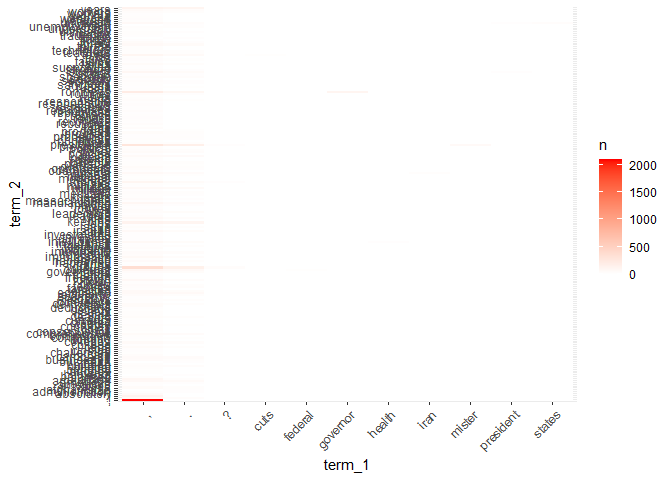

textshape   
============

**textshape** is small suite of text reshaping and restructuring
functions. Many of these functions are descended from tools in the
[**qdapTools**](https://github.com/trinker/qdapTools) package. This
brings reshaping tools under one roof with specific functionality of the
package limited to text reshaping.

Other R packages provide some of the same functionality. **textshape**
differs from these packages in that it is designed to help the user take
unstructured data (or implicitly structured), extract it into a
structured format, and then restructure into common text analysis
formats for use in the next stage of the text analysis pipeline. The
implicit structure of seemingly unstructured data is often
detectable/expressible by the researcher. **textshape** provides tools
(e.g., `split_match`) to enable the researcher to convert this tacit
knowledge into a form that can be used to reformat data into more
structured formats. This package is meant to be used jointly with the
[**textclean**](https://github.com/trinker/textclean) package, which
provides cleaning and text normalization functionality. Additionally,
the [**textreadr**](https://github.com/trinker/textreadr) package is
designed to import various common text data sources into R for reshaping
and cleaning.

Table of Contents
============

-   [Functions](#functions)
-   [Installation](#installation)
-   [Contact](#contact)
-   [Contributing](#contributing)
-   [Examples](#examples)
-   [Loading Dependencies](#loading-dependencies)
    -   [Tidying](#tidying)
        -   [A Vector](#a-vector)
        -   [A Dataframe](#a-dataframe)
        -   [A Named Vector](#a-named-vector)
        -   [A Table](#a-table)
        -   [A Matrix](#a-matrix)
        -   [A DocumentTermMatrix](#a-documenttermmatrix)
        -   [A DocumentTermMatrix of Collocations](#a-documenttermmatrix-of-collocations)
    -   [Combining](#combining)
        -   [A Vector](#a-vector-1)
        -   [A Dataframe](#a-dataframe-1)
    -   [Tabulating](#tabulating)
        -   [A Vector](#a-vector-2)
        -   [A Dataframe](#a-dataframe-2)
    -   [Flattening](#flattening)
    -   [Spanning](#spanning)
        -   [A Vector](#a-vector-3)
        -   [A Dataframe](#a-dataframe-3)
        -   [Gantt Plot](#gantt-plot)
    -   [Splitting](#splitting)
        -   [Indices](#indices)
        -   [Matches](#matches)
        -   [Portions](#portions)
        -   [Runs](#runs)
        -   [Sentences](#sentences)
        -   [Speakers](#speakers)
        -   [Tokens](#tokens)
        -   [Transcript](#transcript)
        -   [Words](#words)
    -   [Putting It Together](#putting-it-together)

Functions
============

Most of the functions split, expand, or tidy a `vector`, `list`,
`data.frame`, or `DocumentTermMatrix`. The `combine`, `duration`,
`mtabulate`, & `flatten` functions are notable exceptions. The table
below describes the functions and their use:

<table style="width:100%;">
<colgroup>
<col width="16%" />
<col width="28%" />
<col width="54%" />
</colgroup>
<thead>
<tr class="header">
<th>Function</th>
<th>Used On</th>
<th>Description</th>
</tr>
</thead>
<tbody>
<tr class="odd">
<td><code>combine</code></td>
<td><code>vector</code>, <code>list</code>, <code>data.frame</code></td>
<td>Combine and collapse elements</td>
</tr>
<tr class="even">
<td><code>tidy_list</code></td>
<td><code>list</code> of <code>vector</code>s or <code>data.frame</code>s</td>
<td>Row bind a list and repeat list names as id column</td>
</tr>
<tr class="odd">
<td><code>tidy_vector</code></td>
<td><code>vector</code></td>
<td>Column bind a named atomic <code>vector</code>'s names and values</td>
</tr>
<tr class="even">
<td><code>tidy_table</code></td>
<td><code>table</code></td>
<td>Column bind a <code>table</code>'s names and values</td>
</tr>
<tr class="odd">
<td><code>tidy_matrix</code></td>
<td><code>matrix</code></td>
<td>Stack values, repeat column row names accordingly</td>
</tr>
<tr class="even">
<td><code>tidy_dtm</code>/<code>tidy_tdm</code></td>
<td><code>DocumentTermMatrix</code></td>
<td>Tidy format <code>DocumentTermMatrix</code>/<code>TermDocumentMatrix</code></td>
</tr>
<tr class="odd">
<td><code>tidy_colo_dtm</code>/<code>tidy_colo_tdm</code></td>
<td><code>DocumentTermMatrix</code></td>
<td>Tidy format of collocating words from a <code>DocumentTermMatrix</code>/<code>TermDocumentMatrix</code></td>
</tr>
<tr class="even">
<td><code>duration</code></td>
<td><code>vector</code>, <code>data.frame</code></td>
<td>Get duration (start-end times) for turns of talk in n words</td>
</tr>
<tr class="odd">
<td><code>from_to</code></td>
<td><code>vector</code>, <code>data.frame</code></td>
<td>Prepare speaker data for a flow network</td>
</tr>
<tr class="even">
<td><code>mtabulate</code></td>
<td><code>vector</code>, <code>list</code>, <code>data.frame</code></td>
<td>Dataframe/list version of <code>tabulate</code> to produce count matrix</td>
</tr>
<tr class="odd">
<td><code>flatten</code></td>
<td><code>list</code></td>
<td>Flatten nested, named list to single tier</td>
</tr>
<tr class="even">
<td><code>unnest_text</code></td>
<td><code>data.frame</code></td>
<td>Unnest a nested text column</td>
</tr>
<tr class="odd">
<td><code>split_index</code></td>
<td><code>vector</code>, <code>list</code>, <code>data.frame</code></td>
<td>Split at specified indices</td>
</tr>
<tr class="even">
<td><code>split_match</code></td>
<td><code>vector</code></td>
<td>Split vector at specified character/regex match</td>
</tr>
<tr class="odd">
<td><code>split_portion</code></td>
<td><code>vector</code>*</td>
<td>Split data into portioned chunks</td>
</tr>
<tr class="even">
<td><code>split_run</code></td>
<td><code>vector</code>, <code>data.frame</code></td>
<td>Split runs (e.g., &quot;aaabbbbcdddd&quot;)</td>
</tr>
<tr class="odd">
<td><code>split_sentence</code></td>
<td><code>vector</code>, <code>data.frame</code></td>
<td>Split sentences</td>
</tr>
<tr class="even">
<td><code>split_speaker</code></td>
<td><code>data.frame</code></td>
<td>Split combined speakers (e.g., &quot;Josh, Jake, Jim&quot;)</td>
</tr>
<tr class="odd">
<td><code>split_token</code></td>
<td><code>vector</code>, <code>data.frame</code></td>
<td>Split words and punctuation</td>
</tr>
<tr class="even">
<td><code>split_transcript</code></td>
<td><code>vector</code></td>
<td>Split speaker and dialogue (e.g., &quot;greg: Who me&quot;)</td>
</tr>
<tr class="odd">
<td><code>split_word</code></td>
<td><code>vector</code>, <code>data.frame</code></td>
<td>Split words</td>
</tr>
<tr class="even">
<td><code>column_to_rownames</code></td>
<td><code>data.frame</code></td>
<td>Add a column as rownames</td>
</tr>
<tr class="odd">
<td><code>cluster_matrix</code></td>
<td><code>matrix</code></td>
<td>Reorder column/rows of a matrix via hierarchical clustering</td>
</tr>
</tbody>
</table>

\****Note:*** *Text vector accompanied by aggregating `grouping.var`
argument, which can be in the form of a `vector`, `list`, or
`data.frame`*

Installation
============

To download the development version of **textshape**:

Download the [zip
ball](https://github.com/trinker/textshape/zipball/master) or [tar
ball](https://github.com/trinker/textshape/tarball/master), decompress
and run `R CMD INSTALL` on it, or use the **pacman** package to install
the development version:

    if (!require("pacman")) install.packages("pacman")
    pacman::p_load_gh("trinker/textshape")

Contact
=======

You are welcome to:

-   submit suggestions and bug-reports at:
    <https://github.com/trinker/textshape/issues>

Contributing
============

Contributions are welcome from anyone subject to the following rules:

-   Abide by the [code of conduct](CONDUCT.md).
-   Follow the style conventions of the package (indentation, function &
    argument naming, commenting, etc.)
-   All contributions must be consistent with the package license
    (GPL-2)
-   Submit contributions as a pull request. Clearly state what the
    changes are and try to keep the number of changes per pull request
    as low as possible.
-   If you make big changes, add your name to the 'Author' field.

Examples
========

The main shaping functions can be broken into the categories of (a)
binding, (b) combining, (c) tabulating, (d) spanning, (e) splitting, &
(f) tidying. The majority of functions in **textshape** fall into the
category of splitting and expanding (the semantic opposite of
combining). These sections will provide example uses of the functions
from **textshape** within the three categories.

Loading Dependencies
====================

    if (!require("pacman")) install.packages("pacman")
    pacman::p_load(tidyverse, magrittr, ggstance, viridis, gridExtra, textreadr, quanteda)
    pacman::p_load_current_gh('trinker/gofastr', 'trinker/textshape')

Tidying
-------

The `tidy_xxx` functions convert untidy structures into [tidy
format](https://www.jstatsoft.org/article/view/v059i10). Tidy formatted
text data structures are particularly useful for interfacing with
**ggplot2**, which expects this form.

The `tidy_list` function is used in the style of
`do.call(rbind, list(x1, x2))` as a convenient way to bind together
multiple named `data.frame`s or `vectors`s into a single `data.frame`
with the `list` `names` acting as an id column. The `data.frame` bind is
particularly useful for binding transcripts from different observations.
Additionally, `tidy_vector` and `tidy_table` are provided for `cbinding`
a `table`'s or named atomic `vector`'s values and names as separate
columns in a `data.frame`. Lastly, `tidy_dtm`/`tidy_tdm` provide
convenient ways to tidy a `DocumentTermMatrix` or `TermDocumentMatrix`.

#### A Vector

    x <- list(p=1:500, r=letters)
    tidy_list(x)

    ##      id content
    ##   1:  p       1
    ##   2:  p       2
    ##   3:  p       3
    ##   4:  p       4
    ##   5:  p       5
    ##  ---           
    ## 522:  r       v
    ## 523:  r       w
    ## 524:  r       x
    ## 525:  r       y
    ## 526:  r       z

#### A Dataframe

    x <- list(p=mtcars, r=mtcars, z=mtcars, d=mtcars)
    tidy_list(x) 

    ##      id  mpg cyl  disp  hp drat    wt  qsec vs am gear carb
    ##   1:  p 21.0   6 160.0 110 3.90 2.620 16.46  0  1    4    4
    ##   2:  p 21.0   6 160.0 110 3.90 2.875 17.02  0  1    4    4
    ##   3:  p 22.8   4 108.0  93 3.85 2.320 18.61  1  1    4    1
    ##   4:  p 21.4   6 258.0 110 3.08 3.215 19.44  1  0    3    1
    ##   5:  p 18.7   8 360.0 175 3.15 3.440 17.02  0  0    3    2
    ##  ---                                                       
    ## 124:  d 30.4   4  95.1 113 3.77 1.513 16.90  1  1    5    2
    ## 125:  d 15.8   8 351.0 264 4.22 3.170 14.50  0  1    5    4
    ## 126:  d 19.7   6 145.0 175 3.62 2.770 15.50  0  1    5    6
    ## 127:  d 15.0   8 301.0 335 3.54 3.570 14.60  0  1    5    8
    ## 128:  d 21.4   4 121.0 109 4.11 2.780 18.60  1  1    4    2

#### A Named Vector

    x <- setNames(
        sample(LETTERS[1:6], 1000, TRUE), 
        sample(state.name[1:5], 1000, TRUE)
    )
    tidy_vector(x)

    ##               id content
    ##    1: California       B
    ##    2:     Alaska       D
    ##    3:     Alaska       E
    ##    4:    Alabama       D
    ##    5:     Alaska       A
    ##   ---                   
    ##  996:    Alabama       C
    ##  997: California       E
    ##  998:     Alaska       F
    ##  999:    Arizona       C
    ## 1000: California       C

#### A Table

    x <- table(sample(LETTERS[1:6], 1000, TRUE))
    tidy_table(x)

    ##    id content
    ## 1:  A     159
    ## 2:  B     187
    ## 3:  C     167
    ## 4:  D     173
    ## 5:  E     145
    ## 6:  F     169

#### A Matrix

    mat <- matrix(1:16, nrow = 4,
        dimnames = list(LETTERS[1:4], LETTERS[23:26])
    )

    mat

    ##   W X  Y  Z
    ## A 1 5  9 13
    ## B 2 6 10 14
    ## C 3 7 11 15
    ## D 4 8 12 16

    tidy_matrix(mat)

    ##     row col value
    ##  1:   A   W     1
    ##  2:   B   W     2
    ##  3:   C   W     3
    ##  4:   D   W     4
    ##  5:   A   X     5
    ##  6:   B   X     6
    ##  7:   C   X     7
    ##  8:   D   X     8
    ##  9:   A   Y     9
    ## 10:   B   Y    10
    ## 11:   C   Y    11
    ## 12:   D   Y    12
    ## 13:   A   Z    13
    ## 14:   B   Z    14
    ## 15:   C   Z    15
    ## 16:   D   Z    16

With clustering (column and row reordering) via the `cluster_matrix`
function.

    ## plot heatmap w/o clustering
    wo <- mtcars %>%
        cor() %>%
        tidy_matrix('car', 'var') %>%
        ggplot(aes(var, car, fill = value)) +
             geom_tile() +
             scale_fill_viridis(name = expression(r[xy])) +
             theme(
                 axis.text.y = element_text(size = 8)   ,
                 axis.text.x = element_text(size = 8, hjust = 1, vjust = 1, angle = 45),   
                 legend.position = 'bottom',
                 legend.key.height = grid::unit(.1, 'cm'),
                 legend.key.width = grid::unit(.5, 'cm')
             ) +
             labs(subtitle = "With Out Clustering")

    ## plot heatmap w clustering
    w <- mtcars %>%
        cor() %>%
        cluster_matrix() %>%
        tidy_matrix('car', 'var') %>%
        mutate(
            var = factor(var, levels = unique(var)),
            car = factor(car, levels = unique(car))        
        ) %>%
        group_by(var) %>%
        ggplot(aes(var, car, fill = value)) +
             geom_tile() +
             scale_fill_viridis(name = expression(r[xy])) +
             theme(
                 axis.text.y = element_text(size = 8)   ,
                 axis.text.x = element_text(size = 8, hjust = 1, vjust = 1, angle = 45),   
                 legend.position = 'bottom',
                 legend.key.height = grid::unit(.1, 'cm'),
                 legend.key.width = grid::unit(.5, 'cm')               
             ) +
             labs(subtitle = "With Clustering")

    grid.arrange(wo, w, ncol = 2)

#### A DocumentTermMatrix

The `tidy_dtm` and `tidy_tdm` functions convert a `DocumentTermMatrix`
or `TermDocumentMatrix` into a tidied data set.

    my_dtm <- with(presidential_debates_2012, q_dtm(dialogue, paste(time, tot, sep = "_")))

    tidy_dtm(my_dtm) %>%
        tidyr::extract(doc, c("time", "turn", "sentence"), "(\\d)_(\\d+)\\.(\\d+)") %>%
        mutate(
            time = as.numeric(time),
            turn = as.numeric(turn),
            sentence = as.numeric(sentence)
        ) %>%
        tbl_df() %T>%
        print() %>%
        group_by(time, term) %>%
        summarize(n = sum(n)) %>%
        group_by(time) %>%
        arrange(desc(n)) %>%
        slice(1:10) %>%
        mutate(term = factor(paste(term, time, sep = "__"), levels = rev(paste(term, time, sep = "__")))) %>%
        ggplot(aes(x = n, y = term)) +
            geom_barh(stat='identity') +
            facet_wrap(~time, ncol=2, scales = 'free_y') +
            scale_y_discrete(labels = function(x) gsub("__.+$", "", x))

    ## # A tibble: 42,058 x 7
    ##     time  turn sentence term             n     i     j
    ##    <dbl> <dbl>    <dbl> <chr>        <dbl> <int> <int>
    ##  1     1     1        1 we'll            1     1     1
    ##  2     1     1        1 talk             1     1     2
    ##  3     1     1        1 about            2     1     3
    ##  4     1     1        1 specifically     1     1     4
    ##  5     1     1        1 health           1     1     5
    ##  6     1     1        1 care             1     1     6
    ##  7     1     1        1 in               1     1     7
    ##  8     1     1        1 a                1     1     8
    ##  9     1     1        1 moment           1     1     9
    ## 10     1     1        1 .                1     1    10
    ## # ... with 42,048 more rows

#### A DocumentTermMatrix of Collocations

The `tidy_colo_dtm` and `tidy_colo_tdm` functions convert a
`DocumentTermMatrix` or `TermDocumentMatrix` into a collocation matrix
and then a tidied data set.

    my_dtm <- with(presidential_debates_2012, q_dtm(dialogue, paste(time, tot, sep = "_")))
    sw <- unique(c(
        lexicon::sw_jockers, 
        lexicon::sw_loughran_mcdonald_long, 
        lexicon::sw_fry_1000
    ))

    tidy_colo_dtm(my_dtm) %>%
        tbl_df() %>%
        filter(!term_1 %in% c('i', sw) & !term_2 %in% sw) %>%
        filter(term_1 != term_2) %>%
        unique_pairs() %>%
        filter(n > 15) %>%
        complete(term_1, term_2, fill = list(n = 0)) %>%
        ggplot(aes(x = term_1, y = term_2, fill = n)) +
            geom_tile() +
            scale_fill_gradient(low= 'white', high = 'red') +
            theme(axis.text.x = element_text(angle = 45, hjust = 1))

Combining
---------

The `combine` function acts like `paste(x, collapse=" ")` on vectors and
lists of vectors. On dataframes multiple text cells are pasted together
within grouping variables.

#### A Vector

    x <- c("Computer", "is", "fun", ".", "Not", "too", "fun", ".")
    combine(x)

    ## [1] "Computer is fun. Not too fun."

#### A Dataframe

    (dat <- split_sentence(DATA))

    ##         person sex adult                       state code element_id
    ##  1:        sam   m     0            Computer is fun.   K1          1
    ##  2:        sam   m     0                Not too fun.   K1          1
    ##  3:       greg   m     0     No it's not, it's dumb.   K2          2
    ##  4:    teacher   m     1          What should we do?   K3          3
    ##  5:        sam   m     0        You liar, it stinks!   K4          4
    ##  6:       greg   m     0     I am telling the truth!   K5          5
    ##  7:      sally   f     0      How can we be certain?   K6          6
    ##  8:       greg   m     0            There is no way.   K7          7
    ##  9:        sam   m     0             I distrust you.   K8          8
    ## 10:      sally   f     0 What are you talking about?   K9          9
    ## 11: researcher   f     1           Shall we move on?  K10         10
    ## 12: researcher   f     1                  Good then.  K10         10
    ## 13:       greg   m     0                 I'm hungry.  K11         11
    ## 14:       greg   m     0                  Let's eat.  K11         11
    ## 15:       greg   m     0                You already?  K11         11
    ##     sentence_id
    ##  1:           1
    ##  2:           2
    ##  3:           1
    ##  4:           1
    ##  5:           1
    ##  6:           1
    ##  7:           1
    ##  8:           1
    ##  9:           1
    ## 10:           1
    ## 11:           1
    ## 12:           2
    ## 13:           1
    ## 14:           2
    ## 15:           3

    combine(dat[, 1:5, with=FALSE])

    ##         person sex adult                               state code
    ##  1:        sam   m     0       Computer is fun. Not too fun.   K1
    ##  2:       greg   m     0             No it's not, it's dumb.   K2
    ##  3:    teacher   m     1                  What should we do?   K3
    ##  4:        sam   m     0                You liar, it stinks!   K4
    ##  5:       greg   m     0             I am telling the truth!   K5
    ##  6:      sally   f     0              How can we be certain?   K6
    ##  7:       greg   m     0                    There is no way.   K7
    ##  8:        sam   m     0                     I distrust you.   K8
    ##  9:      sally   f     0         What are you talking about?   K9
    ## 10: researcher   f     1        Shall we move on? Good then.  K10
    ## 11:       greg   m     0 I'm hungry. Let's eat. You already?  K11

Tabulating
----------

`mtabulate` allows the user to transform data types into a dataframe of
counts.

#### A Vector

    (x <- list(w=letters[1:10], x=letters[1:5], z=letters))

    ## $w
    ##  [1] "a" "b" "c" "d" "e" "f" "g" "h" "i" "j"
    ## 
    ## $x
    ## [1] "a" "b" "c" "d" "e"
    ## 
    ## $z
    ##  [1] "a" "b" "c" "d" "e" "f" "g" "h" "i" "j" "k" "l" "m" "n" "o" "p" "q"
    ## [18] "r" "s" "t" "u" "v" "w" "x" "y" "z"

    mtabulate(x)

    ##   a b c d e f g h i j k l m n o p q r s t u v w x y z
    ## w 1 1 1 1 1 1 1 1 1 1 0 0 0 0 0 0 0 0 0 0 0 0 0 0 0 0
    ## x 1 1 1 1 1 0 0 0 0 0 0 0 0 0 0 0 0 0 0 0 0 0 0 0 0 0
    ## z 1 1 1 1 1 1 1 1 1 1 1 1 1 1 1 1 1 1 1 1 1 1 1 1 1 1

    ## Dummy coding
    mtabulate(mtcars$cyl[1:10])

    ##    4 6 8
    ## 1  0 1 0
    ## 2  0 1 0
    ## 3  1 0 0
    ## 4  0 1 0
    ## 5  0 0 1
    ## 6  0 1 0
    ## 7  0 0 1
    ## 8  1 0 0
    ## 9  1 0 0
    ## 10 0 1 0

#### A Dataframe

    (dat <- data.frame(matrix(sample(c("A", "B"), 30, TRUE), ncol=3)))

    ##    X1 X2 X3
    ## 1   B  B  A
    ## 2   A  A  A
    ## 3   A  B  A
    ## 4   A  B  B
    ## 5   A  A  B
    ## 6   B  A  B
    ## 7   A  B  B
    ## 8   A  B  A
    ## 9   A  B  A
    ## 10  A  A  A

    mtabulate(dat)

    ##    A B
    ## X1 8 2
    ## X2 4 6
    ## X3 6 4

    t(mtabulate(dat))

    ##   X1 X2 X3
    ## A  8  4  6
    ## B  2  6  4

Flattening
----------

`flatten` allows the user to flatten a named, nested list of atomic
vectors to a single level using the concatenated list/atomic vector
names as the names of the single tiered list. This is particularly
useful for flattening dictionaries as seen below. First we see the
**quanteda** dictionary.

    mydict <- textreadr::download("https://provalisresearch.com/Download/LaverGarry.zip") %>%
        unzip(exdir = tempdir()) %>%
        `[`(1) %>%
        quanteda::dictionary(file = .)

    ## LaverGarry.zip read into C:\Users\trinker\AppData\Local\Temp\RtmpywB1X0

    mydict

    ## Dictionary object with 9 primary key entries and 2 nested levels.
    ## - [CULTURE]:
    ##   - people, war_in_iraq, civil_war
    ##   - [CULTURE-HIGH]:
    ##     - art, artistic, dance, galler*, museum*, music*, opera*, theatre*
    ##   - [CULTURE-POPULAR]:
    ##     - media
    ##   - [SPORT]:
    ##     - angler*
    ## - [ECONOMY]:
    ##   - [+STATE+]:
    ##     - accommodation, age, ambulance, assist, benefit, care, carer*, child*, class, classes, clinics, collective*, contribution*, cooperative*, co-operative*, deprivation, disabilities, disadvantaged, educat*, elderly, equal*, establish, fair*, guarantee*, hardship, health*, homeless*, hospital*, hunger, inequal*, invest, investing, investment, means-test*, nurse*, patients, pension, poor, poorer, poorest, poverty, rehouse*, re-house*, school, teach*, transport, underfund*, unemploy*, vulnerable, widow*
    ##   - [=STATE=]:
    ##     - accountant, accounting, accounts, advert*, airline*, airport*, audit*, bank*, bargaining, breadwinner*, budget*, buy*, cartel*, cash*, charge*, commerce*, compensat*, consum*, cost*, credit*, customer*, debt*, deficit*, dwelling*, earn*, econ*, electricity, estate*, export*, fee, fees, financ*, hous*, import, imports, industr*, jobs, lease*, loan*, manufactur*, mortgage*, negotiat*, opportunity, partnership*, passenger*, pay*, performance, port*, productivity, profession*, purchas*, railway*, rebate*, recession*, research*, revenue*, salar*, sell*, settlement, software, supplier*, supply, telecom*, telephon*, tenan*, touris*, trade, train*, wage*, welfare, work*
    ##   - [-STATE-]:
    ##     - assets, autonomy, barrier*, bid, bidders, bidding, burden*, charit*, choice*, compet*, confidence, confiscatory, constrain*, contracting*, contractor*, controlled, controlling, controls, corporate, corporation*, deregulating, dismantl*, entrepreneur*, expensive, flexib*, franchise*, fundhold*, fund-holding, homestead*, initiative, intrusive, investor*, liberali*, market*, monetary, money, own*, private, privately, privatisations, privatised, privatising, produce*, profitable, regulat*, retail*, risk, risks, savings, sell*, shares, simplif*, spend*, sponsorship, taxable, taxes, tax-free, thrift*, trading, value, volunt*, voucher*
    ## - [ENVIRONMENT]:
    ##   - [CON ENVIRONMENT]:
    ##     - produc*
    ##   - [PRO ENVIRONMENT]:
    ##     - car, catalytic, chemical*, chimney*, clean*, congestion, cyclist*, deplet*, ecolog*, emission*, energy-saving, environment*, fur, green, habitat*, hedgerow*, husbanded, litter*, opencast, open-cast*, ozone, planet, population, recycl*, re-cycl*, re-use, toxic, warming
    ## - [GROUPS]:
    ##   - [ETHNIC]:
    ##     - asian*, buddhist*, ethnic*, race, raci*
    ##   - [WOMEN]:
    ##     - girls, woman, women
    ## - [INSTITUTIONS]:
    ##   - [CONSERVATIVE]:
    ##     - authority, continu*, disrupt*, inspect*, jurisdiction*, legitimate, manag*, moratorium, rul*, strike*, whitehall
    ##   - [NEUTRAL]:
    ##     - administr*, advis*, agenc*, amalgamat*, appoint*, assembly, chair*, commission*, committee*, constituen*, council*, department*, directorate*, executive*, headquarters, legislat*, mechanism*, minister*, office, offices, official, operat*, opposition, organisation*, parliament*, presiden*, procedur*, process*, queen, regist*, scheme*, secretariat*, sovereign*, subcommittee*, tribunal*, vote*, voting, westminster
    ##   - [RADICAL]:
    ##     - abolition, accountable, answerable, consult*, corrupt*, democratic*, elect*, implement*, modern*, monitor*, rebuild*, reexamine*, reform*, re-organi*, repeal*, replace*, representat*, scandal*, scrap, scrap*, scrutin*, transform*, voice*
    ## - [LAW_AND_ORDER]:
    ##   - [LAW-CONSERVATIVE]:
    ##     - assaults, bail, burglar*, constab*, convict*, court, courts, custod*, dealing, delinquen*, deter, deter*, disorder, drug*, fine, fines, firmness, force*, fraud*, guard*, hooligan*, illegal*, intimidat*, joy-ride*, lawless*, magistrat*, offence*, officer*, penal*, police, policemen, policing, prison*, probation, prosecution, punish*, re-offend, ruc, seiz*, sentence*, shop-lifting, squatting, terror*, theft*, thug*, tough*, trafficker*, uniformed, unlawful, vandal*, victim*, vigilan*
    ##   - [LAW-LIBERAL]:
    ##     - harassment, non-custodial
    ## - [RURAL]:
    ##   - agricultur*, badgers, bird*, countryside, farm*, feed, fish*, forest*, hens, horse*, landscape*, lane*, livestock, meadows, village*, wildlife
    ## - [URBAN]:
    ##   - town*
    ## - [VALUES]:
    ##   - [CONSERVATIVE]:
    ##     - defend, defended, defending, discipline, glories, glorious, grammar, heritage, histor*, honour*, immigra*, inherit*, integrity, jubilee*, leader*, maintain, majesty, marriage, obscen*, past, pornograph*, preserv*, pride, principl*, probity, professionalism, proud, punctual*, recapture*, reliab*, threat*, tradition*
    ##   - [LIBERAL]:
    ##     - cruel*, discriminat*, human*, injustice*, innocent, inter_racial, minorit*, repressi*, rights, sex*

And now we coerce the dictionary to a list and flatten it. This could
have been combined with the chain above but I wanted the user to see the
original dictionary structure as well.

    mydict %>%
        as.list() %>%
        flatten()

    ## $CULTURE___
    ## [1] "people"      "war_in_iraq" "civil_war"  
    ## 
    ## $`CULTURE_CULTURE-HIGH`
    ## [1] "art"      "artistic" "dance"    "galler*"  "museum*"  "music*"  
    ## [7] "opera*"   "theatre*"
    ## 
    ## $`CULTURE_CULTURE-POPULAR`
    ## [1] "media"
    ## 
    ## $CULTURE_SPORT
    ## [1] "angler*"
    ## 
    ## $`ECONOMY_-STATE-`
    ##  [1] "assets"         "autonomy"       "barrier*"       "bid"           
    ##  [5] "bidders"        "bidding"        "burden*"        "charit*"       
    ##  [9] "choice*"        "compet*"        "confidence"     "confiscatory"  
    ## [13] "constrain*"     "contracting*"   "contractor*"    "controlled"    
    ## [17] "controlling"    "controls"       "corporate"      "corporation*"  
    ## [21] "deregulating"   "dismantl*"      "entrepreneur*"  "expensive"     
    ## [25] "flexib*"        "franchise*"     "fundhold*"      "fund-holding"  
    ## [29] "homestead*"     "initiative"     "intrusive"      "investor*"     
    ## [33] "liberali*"      "market*"        "monetary"       "money"         
    ## [37] "own*"           "private"        "privately"      "privatisations"
    ## [41] "privatised"     "privatising"    "produce*"       "profitable"    
    ## [45] "regulat*"       "retail*"        "risk"           "risks"         
    ## [49] "savings"        "sell*"          "shares"         "simplif*"      
    ## [53] "spend*"         "sponsorship"    "taxable"        "taxes"         
    ## [57] "tax-free"       "thrift*"        "trading"        "value"         
    ## [61] "volunt*"        "voucher*"      
    ## 
    ## $`ECONOMY_+STATE+`
    ##  [1] "accommodation" "age"           "ambulance"     "assist"       
    ##  [5] "benefit"       "care"          "carer*"        "child*"       
    ##  [9] "class"         "classes"       "clinics"       "collective*"  
    ## [13] "contribution*" "cooperative*"  "co-operative*" "deprivation"  
    ## [17] "disabilities"  "disadvantaged" "educat*"       "elderly"      
    ## [21] "equal*"        "establish"     "fair*"         "guarantee*"   
    ## [25] "hardship"      "health*"       "homeless*"     "hospital*"    
    ## [29] "hunger"        "inequal*"      "invest"        "investing"    
    ## [33] "investment"    "means-test*"   "nurse*"        "patients"     
    ## [37] "pension"       "poor"          "poorer"        "poorest"      
    ## [41] "poverty"       "rehouse*"      "re-house*"     "school"       
    ## [45] "teach*"        "transport"     "underfund*"    "unemploy*"    
    ## [49] "vulnerable"    "widow*"       
    ## 
    ## $`ECONOMY_=STATE=`
    ##  [1] "accountant"   "accounting"   "accounts"     "advert*"     
    ##  [5] "airline*"     "airport*"     "audit*"       "bank*"       
    ##  [9] "bargaining"   "breadwinner*" "budget*"      "buy*"        
    ## [13] "cartel*"      "cash*"        "charge*"      "commerce*"   
    ## [17] "compensat*"   "consum*"      "cost*"        "credit*"     
    ## [21] "customer*"    "debt*"        "deficit*"     "dwelling*"   
    ## [25] "earn*"        "econ*"        "electricity"  "estate*"     
    ## [29] "export*"      "fee"          "fees"         "financ*"     
    ## [33] "hous*"        "import"       "imports"      "industr*"    
    ## [37] "jobs"         "lease*"       "loan*"        "manufactur*" 
    ## [41] "mortgage*"    "negotiat*"    "opportunity"  "partnership*"
    ## [45] "passenger*"   "pay*"         "performance"  "port*"       
    ## [49] "productivity" "profession*"  "purchas*"     "railway*"    
    ## [53] "rebate*"      "recession*"   "research*"    "revenue*"    
    ## [57] "salar*"       "sell*"        "settlement"   "software"    
    ## [61] "supplier*"    "supply"       "telecom*"     "telephon*"   
    ## [65] "tenan*"       "touris*"      "trade"        "train*"      
    ## [69] "wage*"        "welfare"      "work*"       
    ## 
    ## $`ENVIRONMENT_CON ENVIRONMENT`
    ## [1] "produc*"
    ## 
    ## $`ENVIRONMENT_PRO ENVIRONMENT`
    ##  [1] "car"           "catalytic"     "chemical*"     "chimney*"     
    ##  [5] "clean*"        "congestion"    "cyclist*"      "deplet*"      
    ##  [9] "ecolog*"       "emission*"     "energy-saving" "environment*" 
    ## [13] "fur"           "green"         "habitat*"      "hedgerow*"    
    ## [17] "husbanded"     "litter*"       "opencast"      "open-cast*"   
    ## [21] "ozone"         "planet"        "population"    "recycl*"      
    ## [25] "re-cycl*"      "re-use"        "toxic"         "warming"      
    ## 
    ## $GROUPS_ETHNIC
    ## [1] "asian*"    "buddhist*" "ethnic*"   "race"      "raci*"    
    ## 
    ## $GROUPS_WOMEN
    ## [1] "girls" "woman" "women"
    ## 
    ## $INSTITUTIONS_CONSERVATIVE
    ##  [1] "authority"     "continu*"      "disrupt*"      "inspect*"     
    ##  [5] "jurisdiction*" "legitimate"    "manag*"        "moratorium"   
    ##  [9] "rul*"          "strike*"       "whitehall"    
    ## 
    ## $INSTITUTIONS_NEUTRAL
    ##  [1] "administr*"    "advis*"        "agenc*"        "amalgamat*"   
    ##  [5] "appoint*"      "assembly"      "chair*"        "commission*"  
    ##  [9] "committee*"    "constituen*"   "council*"      "department*"  
    ## [13] "directorate*"  "executive*"    "headquarters"  "legislat*"    
    ## [17] "mechanism*"    "minister*"     "office"        "offices"      
    ## [21] "official"      "operat*"       "opposition"    "organisation*"
    ## [25] "parliament*"   "presiden*"     "procedur*"     "process*"     
    ## [29] "queen"         "regist*"       "scheme*"       "secretariat*" 
    ## [33] "sovereign*"    "subcommittee*" "tribunal*"     "vote*"        
    ## [37] "voting"        "westminster"  
    ## 
    ## $INSTITUTIONS_RADICAL
    ##  [1] "abolition"    "accountable"  "answerable"   "consult*"    
    ##  [5] "corrupt*"     "democratic*"  "elect*"       "implement*"  
    ##  [9] "modern*"      "monitor*"     "rebuild*"     "reexamine*"  
    ## [13] "reform*"      "re-organi*"   "repeal*"      "replace*"    
    ## [17] "representat*" "scandal*"     "scrap"        "scrap*"      
    ## [21] "scrutin*"     "transform*"   "voice*"      
    ## 
    ## $`LAW_AND_ORDER_LAW-CONSERVATIVE`
    ##  [1] "assaults"     "bail"         "burglar*"     "constab*"    
    ##  [5] "convict*"     "court"        "courts"       "custod*"     
    ##  [9] "dealing"      "delinquen*"   "deter"        "deter*"      
    ## [13] "disorder"     "drug*"        "fine"         "fines"       
    ## [17] "firmness"     "force*"       "fraud*"       "guard*"      
    ## [21] "hooligan*"    "illegal*"     "intimidat*"   "joy-ride*"   
    ## [25] "lawless*"     "magistrat*"   "offence*"     "officer*"    
    ## [29] "penal*"       "police"       "policemen"    "policing"    
    ## [33] "prison*"      "probation"    "prosecution"  "punish*"     
    ## [37] "re-offend"    "ruc"          "seiz*"        "sentence*"   
    ## [41] "shop-lifting" "squatting"    "terror*"      "theft*"      
    ## [45] "thug*"        "tough*"       "trafficker*"  "uniformed"   
    ## [49] "unlawful"     "vandal*"      "victim*"      "vigilan*"    
    ## 
    ## $`LAW_AND_ORDER_LAW-LIBERAL`
    ## [1] "harassment"    "non-custodial"
    ## 
    ## $RURAL
    ##  [1] "agricultur*" "badgers"     "bird*"       "countryside" "farm*"      
    ##  [6] "feed"        "fish*"       "forest*"     "hens"        "horse*"     
    ## [11] "landscape*"  "lane*"       "livestock"   "meadows"     "village*"   
    ## [16] "wildlife"   
    ## 
    ## $URBAN
    ## [1] "town*"
    ## 
    ## $VALUES_CONSERVATIVE
    ##  [1] "defend"          "defended"        "defending"      
    ##  [4] "discipline"      "glories"         "glorious"       
    ##  [7] "grammar"         "heritage"        "histor*"        
    ## [10] "honour*"         "immigra*"        "inherit*"       
    ## [13] "integrity"       "jubilee*"        "leader*"        
    ## [16] "maintain"        "majesty"         "marriage"       
    ## [19] "obscen*"         "past"            "pornograph*"    
    ## [22] "preserv*"        "pride"           "principl*"      
    ## [25] "probity"         "professionalism" "proud"          
    ## [28] "punctual*"       "recapture*"      "reliab*"        
    ## [31] "threat*"         "tradition*"     
    ## 
    ## $VALUES_LIBERAL
    ##  [1] "cruel*"       "discriminat*" "human*"       "injustice*"  
    ##  [5] "innocent"     "inter_racial" "minorit*"     "repressi*"   
    ##  [9] "rights"       "sex*"

Spanning
--------

Often it is useful to know the duration (start-end) of turns of talk.
The `duration` function calculates start-end durations as n words.

#### A Vector

    (x <- c(
        "Mr. Brown comes! He says hello. i give him coffee.",
        "I'll go at 5 p. m. eastern time.  Or somewhere in between!",
        "go there"
    ))

    ## [1] "Mr. Brown comes! He says hello. i give him coffee."        
    ## [2] "I'll go at 5 p. m. eastern time.  Or somewhere in between!"
    ## [3] "go there"

    duration(x)

    ##    all word.count start end
    ## 1: all         10     1  10
    ## 2: all         12    11  22
    ## 3: all          2    23  24
    ##                                                      text.var
    ## 1:         Mr. Brown comes! He says hello. i give him coffee.
    ## 2: I'll go at 5 p. m. eastern time.  Or somewhere in between!
    ## 3:                                                   go there

    # With grouping variables
    groups <- list(group1 = c("A", "B", "A"), group2 = c("red", "red", "green"))
    duration(x, groups)

    ##    group1 group2 word.count start end
    ## 1:      A    red         10     1  10
    ## 2:      B    red         12    11  22
    ## 3:      A  green          2    23  24
    ##                                                      text.var
    ## 1:         Mr. Brown comes! He says hello. i give him coffee.
    ## 2: I'll go at 5 p. m. eastern time.  Or somewhere in between!
    ## 3:                                                   go there

#### A Dataframe

    duration(DATA)

    ##         person sex adult code word.count start end
    ##  1:        sam   m     0   K1          6     1   6
    ##  2:       greg   m     0   K2          5     7  11
    ##  3:    teacher   m     1   K3          4    12  15
    ##  4:        sam   m     0   K4          4    16  19
    ##  5:       greg   m     0   K5          5    20  24
    ##  6:      sally   f     0   K6          5    25  29
    ##  7:       greg   m     0   K7          4    30  33
    ##  8:        sam   m     0   K8          3    34  36
    ##  9:      sally   f     0   K9          5    37  41
    ## 10: researcher   f     1  K10          6    42  47
    ## 11:       greg   m     0  K11          6    48  53
    ##                                     state
    ##  1:         Computer is fun. Not too fun.
    ##  2:               No it's not, it's dumb.
    ##  3:                    What should we do?
    ##  4:                  You liar, it stinks!
    ##  5:               I am telling the truth!
    ##  6:                How can we be certain?
    ##  7:                      There is no way.
    ##  8:                       I distrust you.
    ##  9:           What are you talking about?
    ## 10:         Shall we move on?  Good then.
    ## 11: I'm hungry.  Let's eat.  You already?

#### Gantt Plot

    library(ggplot2)
    ggplot(duration(DATA), aes(x = start, xend = end, y = person, yend = person, color = sex)) +
        geom_segment(size=4) +
        xlab("Duration (Words)") +
        ylab("Person")

Splitting
---------

The following section provides examples of available splitting
functions.

### Indices

`split_index` allows the user to supply the integer indices of where to
split a data type.

#### A Vector

    split_index(LETTERS, c(4, 10, 16), c("dog", "cat", "chicken", "rabbit"))

    ## $dog
    ## [1] "A" "B" "C"
    ## 
    ## $cat
    ## [1] "D" "E" "F" "G" "H" "I"
    ## 
    ## $chicken
    ## [1] "J" "K" "L" "M" "N" "O"
    ## 
    ## $rabbit
    ##  [1] "P" "Q" "R" "S" "T" "U" "V" "W" "X" "Y" "Z"

#### A Dataframe

Here I calculate the indices of every time the `vs` variable in the
`mtcars` data set changes and then split the dataframe on those indices.
The `change_index` function is handy for extracting the indices of
changes in runs within an [atomic
vector](http://arrgh.tim-smith.us/atomic.html).

    (vs_change <- change_index(mtcars[["vs"]]))

    ##  [1]  3  5  6  7  8 12 18 22 26 27 28 29 32

    split_index(mtcars, vs_change)

    ## [[1]]
    ##               mpg cyl disp  hp drat    wt  qsec vs am gear carb
    ## Mazda RX4      21   6  160 110  3.9 2.620 16.46  0  1    4    4
    ## Mazda RX4 Wag  21   6  160 110  3.9 2.875 17.02  0  1    4    4
    ## 
    ## [[2]]
    ##                 mpg cyl disp  hp drat    wt  qsec vs am gear carb
    ## Datsun 710     22.8   4  108  93 3.85 2.320 18.61  1  1    4    1
    ## Hornet 4 Drive 21.4   6  258 110 3.08 3.215 19.44  1  0    3    1
    ## 
    ## [[3]]
    ##                    mpg cyl disp  hp drat   wt  qsec vs am gear carb
    ## Hornet Sportabout 18.7   8  360 175 3.15 3.44 17.02  0  0    3    2
    ## 
    ## [[4]]
    ##          mpg cyl disp  hp drat   wt  qsec vs am gear carb
    ## Valiant 18.1   6  225 105 2.76 3.46 20.22  1  0    3    1
    ## 
    ## [[5]]
    ##             mpg cyl disp  hp drat   wt  qsec vs am gear carb
    ## Duster 360 14.3   8  360 245 3.21 3.57 15.84  0  0    3    4
    ## 
    ## [[6]]
    ##            mpg cyl  disp  hp drat   wt qsec vs am gear carb
    ## Merc 240D 24.4   4 146.7  62 3.69 3.19 20.0  1  0    4    2
    ## Merc 230  22.8   4 140.8  95 3.92 3.15 22.9  1  0    4    2
    ## Merc 280  19.2   6 167.6 123 3.92 3.44 18.3  1  0    4    4
    ## Merc 280C 17.8   6 167.6 123 3.92 3.44 18.9  1  0    4    4
    ## 
    ## [[7]]
    ##                      mpg cyl  disp  hp drat    wt  qsec vs am gear carb
    ## Merc 450SE          16.4   8 275.8 180 3.07 4.070 17.40  0  0    3    3
    ## Merc 450SL          17.3   8 275.8 180 3.07 3.730 17.60  0  0    3    3
    ## Merc 450SLC         15.2   8 275.8 180 3.07 3.780 18.00  0  0    3    3
    ## Cadillac Fleetwood  10.4   8 472.0 205 2.93 5.250 17.98  0  0    3    4
    ## Lincoln Continental 10.4   8 460.0 215 3.00 5.424 17.82  0  0    3    4
    ## Chrysler Imperial   14.7   8 440.0 230 3.23 5.345 17.42  0  0    3    4
    ## 
    ## [[8]]
    ##                 mpg cyl  disp hp drat    wt  qsec vs am gear carb
    ## Fiat 128       32.4   4  78.7 66 4.08 2.200 19.47  1  1    4    1
    ## Honda Civic    30.4   4  75.7 52 4.93 1.615 18.52  1  1    4    2
    ## Toyota Corolla 33.9   4  71.1 65 4.22 1.835 19.90  1  1    4    1
    ## Toyota Corona  21.5   4 120.1 97 3.70 2.465 20.01  1  0    3    1
    ## 
    ## [[9]]
    ##                   mpg cyl disp  hp drat    wt  qsec vs am gear carb
    ## Dodge Challenger 15.5   8  318 150 2.76 3.520 16.87  0  0    3    2
    ## AMC Javelin      15.2   8  304 150 3.15 3.435 17.30  0  0    3    2
    ## Camaro Z28       13.3   8  350 245 3.73 3.840 15.41  0  0    3    4
    ## Pontiac Firebird 19.2   8  400 175 3.08 3.845 17.05  0  0    3    2
    ## 
    ## [[10]]
    ##            mpg cyl disp hp drat    wt qsec vs am gear carb
    ## Fiat X1-9 27.3   4   79 66 4.08 1.935 18.9  1  1    4    1
    ## 
    ## [[11]]
    ##               mpg cyl  disp hp drat   wt qsec vs am gear carb
    ## Porsche 914-2  26   4 120.3 91 4.43 2.14 16.7  0  1    5    2
    ## 
    ## [[12]]
    ##               mpg cyl disp  hp drat    wt qsec vs am gear carb
    ## Lotus Europa 30.4   4 95.1 113 3.77 1.513 16.9  1  1    5    2
    ## 
    ## [[13]]
    ##                 mpg cyl disp  hp drat   wt qsec vs am gear carb
    ## Ford Pantera L 15.8   8  351 264 4.22 3.17 14.5  0  1    5    4
    ## Ferrari Dino   19.7   6  145 175 3.62 2.77 15.5  0  1    5    6
    ## Maserati Bora  15.0   8  301 335 3.54 3.57 14.6  0  1    5    8
    ## 
    ## [[14]]
    ##             mpg cyl disp  hp drat   wt qsec vs am gear carb
    ## Volvo 142E 21.4   4  121 109 4.11 2.78 18.6  1  1    4    2

### Matches

`split_match` splits on elements that match exactly or via a regular
expression match.

#### Exact Match

    set.seed(15)
    (x <- sample(c("", LETTERS[1:10]), 25, TRUE, prob=c(.2, rep(.08, 10))))

    ##  [1] "C" ""  "A" "C" "D" "A" "I" "B" "H" "I" ""  "C" "E" "H" "J" "J" "E"
    ## [18] "A" ""  "I" "I" "I" "G" ""  "F"

    split_match(x)

    ## $`1`
    ## [1] "C"
    ## 
    ## $`2`
    ## [1] "A" "C" "D" "A" "I" "B" "H" "I"
    ## 
    ## $`3`
    ## [1] "C" "E" "H" "J" "J" "E" "A"
    ## 
    ## $`4`
    ## [1] "I" "I" "I" "G"
    ## 
    ## $`5`
    ## [1] "F"

    split_match(x, "C")

    ## $`1`
    ## [1] ""  "A"
    ## 
    ## $`2`
    ## [1] "D" "A" "I" "B" "H" "I" "" 
    ## 
    ## $`3`
    ##  [1] "E" "H" "J" "J" "E" "A" ""  "I" "I" "I" "G" ""  "F"

    split_match(x, c("", "C"))

    ## $`1`
    ## [1] "A"
    ## 
    ## $`2`
    ## [1] "D" "A" "I" "B" "H" "I"
    ## 
    ## $`3`
    ## [1] "E" "H" "J" "J" "E" "A"
    ## 
    ## $`4`
    ## [1] "I" "I" "I" "G"
    ## 
    ## $`5`
    ## [1] "F"

    ## Don't include
    split_match(x, include = 0)

    ## $`1`
    ## [1] "C"
    ## 
    ## $`2`
    ## [1] "A" "C" "D" "A" "I" "B" "H" "I"
    ## 
    ## $`3`
    ## [1] "C" "E" "H" "J" "J" "E" "A"
    ## 
    ## $`4`
    ## [1] "I" "I" "I" "G"
    ## 
    ## $`5`
    ## [1] "F"

    ## Include at beginning
    split_match(x, include = 1)

    ## $`1`
    ## [1] "C"
    ## 
    ## $`2`
    ## [1] ""  "A" "C" "D" "A" "I" "B" "H" "I"
    ## 
    ## $`3`
    ## [1] ""  "C" "E" "H" "J" "J" "E" "A"
    ## 
    ## $`4`
    ## [1] ""  "I" "I" "I" "G"
    ## 
    ## $`5`
    ## [1] ""  "F"

    ## Include at end
    split_match(x, include = 2)

    ## [[1]]
    ## [1] "C" "" 
    ## 
    ## [[2]]
    ## [1] "A" "C" "D" "A" "I" "B" "H" "I" "" 
    ## 
    ## [[3]]
    ## [1] "C" "E" "H" "J" "J" "E" "A" "" 
    ## 
    ## [[4]]
    ## [1] "I" "I" "I" "G" "" 
    ## 
    ## [[5]]
    ## [1] "F"

#### Regex Match

Here I use the regex `"^I"` to break on any vectors containing the
capital letter I as the first character.

    split_match(DATA[["state"]], "^I", regex=TRUE, include = 1)

    ## $`1`
    ## [1] "Computer is fun. Not too fun." "No it's not, it's dumb."      
    ## [3] "What should we do?"            "You liar, it stinks!"         
    ## 
    ## $`2`
    ## [1] "I am telling the truth!" "How can we be certain?" 
    ## [3] "There is no way."       
    ## 
    ## $`3`
    ## [1] "I distrust you."               "What are you talking about?"  
    ## [3] "Shall we move on?  Good then."
    ## 
    ## $`4`
    ## [1] "I'm hungry.  Let's eat.  You already?"

### Portions

At times it is useful to split texts into portioned chunks, operate on
the chunks and aggregate the results. `split_portion` allows the user to
do this sort of text shaping. We can split into n chunks per grouping
variable (via `n.chunks`) or into chunks of n length (via `n.words`).

#### A Vector

    with(DATA, split_portion(state, n.chunks = 10))

    ##     all index                     text.var
    ##  1: all     1     Computer is fun. Not too
    ##  2: all     2       fun. No it's not, it's
    ##  3: all     3     dumb. What should we do?
    ##  4: all     4       You liar, it stinks! I
    ##  5: all     5    am telling the truth! How
    ##  6: all     6     can we be certain? There
    ##  7: all     7        is no way. I distrust
    ##  8: all     8    you. What are you talking
    ##  9: all     9     about? Shall we move on?
    ## 10: all    10 Good then. I'm hungry. Let's
    ## 11: all    11            eat. You already?

    with(DATA, split_portion(state, n.words = 10))

    ##    all index                                              text.var
    ## 1: all     1       Computer is fun. Not too fun. No it's not, it's
    ## 2: all     2       dumb. What should we do? You liar, it stinks! I
    ## 3: all     3    am telling the truth! How can we be certain? There
    ## 4: all     4       is no way. I distrust you. What are you talking
    ## 5: all     5 about? Shall we move on? Good then. I'm hungry. Let's
    ## 6: all     6                                     eat. You already?

#### A Dataframe

    with(DATA, split_portion(state, list(sex, adult), n.words = 10))

    ##    sex adult index                                           text.var
    ## 1:   f     0     1 How can we be certain? What are you talking about?
    ## 2:   f     1     1                       Shall we move on? Good then.
    ## 3:   m     0     1    Computer is fun. Not too fun. No it's not, it's
    ## 4:   m     0     2 dumb. You liar, it stinks! I am telling the truth!
    ## 5:   m     0     3 There is no way. I distrust you. I'm hungry. Let's
    ## 6:   m     0     4                                  eat. You already?
    ## 7:   m     1     1                                 What should we do?

### Runs

`split_run` allows the user to split up runs of identical characters.

    x1 <- c(
         "122333444455555666666",
         NA,
         "abbcccddddeeeeeffffff",
         "sddfg",
         "11112222333"
    )

    x <- c(rep(x1, 2), ">>???,,,,....::::;[[")

    split_run(x)

    ## [[1]]
    ## [1] "1"      "22"     "333"    "4444"   "55555"  "666666" ""      
    ## 
    ## [[2]]
    ## [1] NA
    ## 
    ## [[3]]
    ## [1] "a"      "bb"     "ccc"    "dddd"   "eeeee"  "ffffff" ""      
    ## 
    ## [[4]]
    ## [1] "s"  "dd" "f"  "g"  ""  
    ## 
    ## [[5]]
    ## [1] "1111" "2222" "333"  ""    
    ## 
    ## [[6]]
    ## [1] "1"      "22"     "333"    "4444"   "55555"  "666666" ""      
    ## 
    ## [[7]]
    ## [1] NA
    ## 
    ## [[8]]
    ## [1] "a"      "bb"     "ccc"    "dddd"   "eeeee"  "ffffff" ""      
    ## 
    ## [[9]]
    ## [1] "s"  "dd" "f"  "g"  ""  
    ## 
    ## [[10]]
    ## [1] "1111" "2222" "333"  ""    
    ## 
    ## [[11]]
    ## [1] ">>???,,,,....::::;[["

#### Dataframe

    DATA[["run.col"]] <- x
    split_run(DATA)

    ##      person sex adult state code               run.col element_id
    ##   1:    sam   m     0     C   K1 122333444455555666666          1
    ##   2:    sam   m     0     o   K1 122333444455555666666          1
    ##   3:    sam   m     0     m   K1 122333444455555666666          1
    ##   4:    sam   m     0     p   K1 122333444455555666666          1
    ##   5:    sam   m     0     u   K1 122333444455555666666          1
    ##  ---                                                             
    ## 196:   greg   m     0     e  K11  >>???,,,,....::::;[[         11
    ## 197:   greg   m     0     a  K11  >>???,,,,....::::;[[         11
    ## 198:   greg   m     0     d  K11  >>???,,,,....::::;[[         11
    ## 199:   greg   m     0     y  K11  >>???,,,,....::::;[[         11
    ## 200:   greg   m     0     ?  K11  >>???,,,,....::::;[[         11
    ##      sentence_id
    ##   1:           1
    ##   2:           2
    ##   3:           3
    ##   4:           4
    ##   5:           5
    ##  ---            
    ## 196:          22
    ## 197:          23
    ## 198:          24
    ## 199:          25
    ## 200:          26

    ## Reset the DATA dataset
    DATA <- textshape::DATA

### Sentences

`split_sentece` provides a mapping + regex approach to splitting
sentences. It is less accurate than the Stanford parser but more
accurate than a simple regular expression approach alone.

#### A Vector

    (x <- paste0(
        "Mr. Brown comes! He says hello. i give him coffee.  i will ",
        "go at 5 p. m. eastern time.  Or somewhere in between!go there"
    ))

    ## [1] "Mr. Brown comes! He says hello. i give him coffee.  i will go at 5 p. m. eastern time.  Or somewhere in between!go there"

    split_sentence(x)

    ## [[1]]
    ## [1] "Mr. Brown comes!"                  "He says hello."                   
    ## [3] "i give him coffee."                "i will go at 5 p.m. eastern time."
    ## [5] "Or somewhere in between!"          "go there"

#### A Dataframe

    split_sentence(DATA)

    ##         person sex adult                       state code element_id
    ##  1:        sam   m     0            Computer is fun.   K1          1
    ##  2:        sam   m     0                Not too fun.   K1          1
    ##  3:       greg   m     0     No it's not, it's dumb.   K2          2
    ##  4:    teacher   m     1          What should we do?   K3          3
    ##  5:        sam   m     0        You liar, it stinks!   K4          4
    ##  6:       greg   m     0     I am telling the truth!   K5          5
    ##  7:      sally   f     0      How can we be certain?   K6          6
    ##  8:       greg   m     0            There is no way.   K7          7
    ##  9:        sam   m     0             I distrust you.   K8          8
    ## 10:      sally   f     0 What are you talking about?   K9          9
    ## 11: researcher   f     1           Shall we move on?  K10         10
    ## 12: researcher   f     1                  Good then.  K10         10
    ## 13:       greg   m     0                 I'm hungry.  K11         11
    ## 14:       greg   m     0                  Let's eat.  K11         11
    ## 15:       greg   m     0                You already?  K11         11
    ##     sentence_id
    ##  1:           1
    ##  2:           2
    ##  3:           1
    ##  4:           1
    ##  5:           1
    ##  6:           1
    ##  7:           1
    ##  8:           1
    ##  9:           1
    ## 10:           1
    ## 11:           1
    ## 12:           2
    ## 13:           1
    ## 14:           2
    ## 15:           3

### Speakers

Often speakers may talk in unison. This is often displayed in a single
cell as a comma separated string of speakers. Some analysis may require
this information to be parsed out and replicated as one turn per
speaker. The `split_speaker` function accomplishes this.

    DATA$person <- as.character(DATA$person)
    DATA$person[c(1, 4, 6)] <- c("greg, sally, & sam",
        "greg, sally", "sam and sally")
    DATA

    ##                person sex adult                                 state code
    ## 1  greg, sally, & sam   m     0         Computer is fun. Not too fun.   K1
    ## 2                greg   m     0               No it's not, it's dumb.   K2
    ## 3             teacher   m     1                    What should we do?   K3
    ## 4         greg, sally   m     0                  You liar, it stinks!   K4
    ## 5                greg   m     0               I am telling the truth!   K5
    ## 6       sam and sally   f     0                How can we be certain?   K6
    ## 7                greg   m     0                      There is no way.   K7
    ## 8                 sam   m     0                       I distrust you.   K8
    ## 9               sally   f     0           What are you talking about?   K9
    ## 10         researcher   f     1         Shall we move on?  Good then.  K10
    ## 11               greg   m     0 I'm hungry.  Let's eat.  You already?  K11

    split_speaker(DATA)

    ##         person sex adult                                 state code
    ##  1:       greg   m     0         Computer is fun. Not too fun.   K1
    ##  2:      sally   m     0         Computer is fun. Not too fun.   K1
    ##  3:        sam   m     0         Computer is fun. Not too fun.   K1
    ##  4:       greg   m     0               No it's not, it's dumb.   K2
    ##  5:    teacher   m     1                    What should we do?   K3
    ##  6:       greg   m     0                  You liar, it stinks!   K4
    ##  7:      sally   m     0                  You liar, it stinks!   K4
    ##  8:       greg   m     0               I am telling the truth!   K5
    ##  9:        sam   f     0                How can we be certain?   K6
    ## 10:      sally   f     0                How can we be certain?   K6
    ## 11:       greg   m     0                      There is no way.   K7
    ## 12:        sam   m     0                       I distrust you.   K8
    ## 13:      sally   f     0           What are you talking about?   K9
    ## 14: researcher   f     1         Shall we move on?  Good then.  K10
    ## 15:       greg   m     0 I'm hungry.  Let's eat.  You already?  K11
    ##     element_id split_id
    ##  1:          1        1
    ##  2:          1        2
    ##  3:          1        3
    ##  4:          2        1
    ##  5:          3        1
    ##  6:          4        1
    ##  7:          4        2
    ##  8:          5        1
    ##  9:          6        1
    ## 10:          6        2
    ## 11:          7        1
    ## 12:          8        1
    ## 13:          9        1
    ## 14:         10        1
    ## 15:         11        1

    ## Reset the DATA dataset
    DATA <- textshape::DATA

### Tokens

The `split_token` function split data into words and punctuation.

#### A Vector

    (x <- c(
        "Mr. Brown comes! He says hello. i give him coffee.",
        "I'll go at 5 p. m. eastern time.  Or somewhere in between!",
        "go there"
    ))

    ## [1] "Mr. Brown comes! He says hello. i give him coffee."        
    ## [2] "I'll go at 5 p. m. eastern time.  Or somewhere in between!"
    ## [3] "go there"

    split_token(x)

    ## [[1]]
    ##  [1] "mr"     "."      "brown"  "comes"  "!"      "he"     "says"  
    ##  [8] "hello"  "."      "i"      "give"   "him"    "coffee" "."     
    ## 
    ## [[2]]
    ##  [1] "i'll"      "go"        "at"        "5"         "p"        
    ##  [6] "."         "m"         "."         "eastern"   "time"     
    ## [11] "."         "or"        "somewhere" "in"        "between"  
    ## [16] "!"        
    ## 
    ## [[3]]
    ## [1] "go"    "there"

#### A Dataframe

     split_token(DATA)

    ##         person sex adult    state code element_id token_id
    ##  1:        sam   m     0 computer   K1          1        1
    ##  2:        sam   m     0       is   K1          1        2
    ##  3:        sam   m     0      fun   K1          1        3
    ##  4:        sam   m     0        .   K1          1        4
    ##  5:        sam   m     0      not   K1          1        5
    ##  6:        sam   m     0      too   K1          1        6
    ##  7:        sam   m     0      fun   K1          1        7
    ##  8:        sam   m     0        .   K1          1        8
    ##  9:       greg   m     0       no   K2          2        1
    ## 10:       greg   m     0     it's   K2          2        2
    ## 11:       greg   m     0      not   K2          2        3
    ## 12:       greg   m     0        ,   K2          2        4
    ## 13:       greg   m     0     it's   K2          2        5
    ## 14:       greg   m     0     dumb   K2          2        6
    ## 15:       greg   m     0        .   K2          2        7
    ## 16:    teacher   m     1     what   K3          3        1
    ## 17:    teacher   m     1   should   K3          3        2
    ## 18:    teacher   m     1       we   K3          3        3
    ## 19:    teacher   m     1       do   K3          3        4
    ## 20:    teacher   m     1        ?   K3          3        5
    ## 21:        sam   m     0      you   K4          4        1
    ## 22:        sam   m     0     liar   K4          4        2
    ## 23:        sam   m     0        ,   K4          4        3
    ## 24:        sam   m     0       it   K4          4        4
    ## 25:        sam   m     0   stinks   K4          4        5
    ## 26:        sam   m     0        !   K4          4        6
    ## 27:       greg   m     0        i   K5          5        1
    ## 28:       greg   m     0       am   K5          5        2
    ## 29:       greg   m     0  telling   K5          5        3
    ## 30:       greg   m     0      the   K5          5        4
    ## 31:       greg   m     0    truth   K5          5        5
    ## 32:       greg   m     0        !   K5          5        6
    ## 33:      sally   f     0      how   K6          6        1
    ## 34:      sally   f     0      can   K6          6        2
    ## 35:      sally   f     0       we   K6          6        3
    ## 36:      sally   f     0       be   K6          6        4
    ## 37:      sally   f     0  certain   K6          6        5
    ## 38:      sally   f     0        ?   K6          6        6
    ## 39:       greg   m     0    there   K7          7        1
    ## 40:       greg   m     0       is   K7          7        2
    ## 41:       greg   m     0       no   K7          7        3
    ## 42:       greg   m     0      way   K7          7        4
    ## 43:       greg   m     0        .   K7          7        5
    ## 44:        sam   m     0        i   K8          8        1
    ## 45:        sam   m     0 distrust   K8          8        2
    ## 46:        sam   m     0      you   K8          8        3
    ## 47:        sam   m     0        .   K8          8        4
    ## 48:      sally   f     0     what   K9          9        1
    ## 49:      sally   f     0      are   K9          9        2
    ## 50:      sally   f     0      you   K9          9        3
    ## 51:      sally   f     0  talking   K9          9        4
    ## 52:      sally   f     0    about   K9          9        5
    ## 53:      sally   f     0        ?   K9          9        6
    ## 54: researcher   f     1    shall  K10         10        1
    ## 55: researcher   f     1       we  K10         10        2
    ## 56: researcher   f     1     move  K10         10        3
    ## 57: researcher   f     1       on  K10         10        4
    ## 58: researcher   f     1        ?  K10         10        5
    ## 59: researcher   f     1     good  K10         10        6
    ## 60: researcher   f     1     then  K10         10        7
    ## 61: researcher   f     1        .  K10         10        8
    ## 62:       greg   m     0      i'm  K11         11        1
    ## 63:       greg   m     0   hungry  K11         11        2
    ## 64:       greg   m     0        .  K11         11        3
    ## 65:       greg   m     0    let's  K11         11        4
    ## 66:       greg   m     0      eat  K11         11        5
    ## 67:       greg   m     0        .  K11         11        6
    ## 68:       greg   m     0      you  K11         11        7
    ## 69:       greg   m     0  already  K11         11        8
    ## 70:       greg   m     0        ?  K11         11        9
    ##         person sex adult    state code element_id token_id

### Transcript

The `split_transcript` function splits `vector`s with speaker prefixes
(e.g., `c("greg: Who me", "sarah: yes you!")`) into a two column
`data.frame`.

#### A Vector

    (x <- c(
        "greg: Who me", 
        "sarah: yes you!",
        "greg: well why didn't you say so?",
        "sarah: I did but you weren't listening.",
        "greg: oh :-/ I see...",
        "dan: Ok let's meet at 4:30 pm for drinks"
    ))

    ## [1] "greg: Who me"                            
    ## [2] "sarah: yes you!"                         
    ## [3] "greg: well why didn't you say so?"       
    ## [4] "sarah: I did but you weren't listening." 
    ## [5] "greg: oh :-/ I see..."                   
    ## [6] "dan: Ok let's meet at 4:30 pm for drinks"

    split_transcript(x)

    ##    person                            dialogue
    ## 1:   greg                              Who me
    ## 2:  sarah                            yes you!
    ## 3:   greg         well why didn't you say so?
    ## 4:  sarah    I did but you weren't listening.
    ## 5:   greg                     oh :-/ I see...
    ## 6:    dan Ok let's meet at 4:30 pm for drinks

### Words

The `split_word` function splits data into words.

#### A Vector

    (x <- c(
        "Mr. Brown comes! He says hello. i give him coffee.",
        "I'll go at 5 p. m. eastern time.  Or somewhere in between!",
        "go there"
    ))

    ## [1] "Mr. Brown comes! He says hello. i give him coffee."        
    ## [2] "I'll go at 5 p. m. eastern time.  Or somewhere in between!"
    ## [3] "go there"

    split_word(x)

    ## [[1]]
    ##  [1] "mr"     "brown"  "comes"  "he"     "says"   "hello"  "i"     
    ##  [8] "give"   "him"    "coffee"
    ## 
    ## [[2]]
    ##  [1] "i'll"      "go"        "at"        "5"         "p"        
    ##  [6] "m"         "eastern"   "time"      "or"        "somewhere"
    ## [11] "in"        "between"  
    ## 
    ## [[3]]
    ## [1] "go"    "there"

#### A Dataframe

     split_word(DATA)

    ##         person sex adult    state code element_id word_id
    ##  1:        sam   m     0 computer   K1          1       1
    ##  2:        sam   m     0       is   K1          1       2
    ##  3:        sam   m     0      fun   K1          1       3
    ##  4:        sam   m     0      not   K1          1       4
    ##  5:        sam   m     0      too   K1          1       5
    ##  6:        sam   m     0      fun   K1          1       6
    ##  7:       greg   m     0       no   K2          2       1
    ##  8:       greg   m     0     it's   K2          2       2
    ##  9:       greg   m     0      not   K2          2       3
    ## 10:       greg   m     0     it's   K2          2       4
    ## 11:       greg   m     0     dumb   K2          2       5
    ## 12:    teacher   m     1     what   K3          3       1
    ## 13:    teacher   m     1   should   K3          3       2
    ## 14:    teacher   m     1       we   K3          3       3
    ## 15:    teacher   m     1       do   K3          3       4
    ## 16:        sam   m     0      you   K4          4       1
    ## 17:        sam   m     0     liar   K4          4       2
    ## 18:        sam   m     0       it   K4          4       3
    ## 19:        sam   m     0   stinks   K4          4       4
    ## 20:       greg   m     0        i   K5          5       1
    ## 21:       greg   m     0       am   K5          5       2
    ## 22:       greg   m     0  telling   K5          5       3
    ## 23:       greg   m     0      the   K5          5       4
    ## 24:       greg   m     0    truth   K5          5       5
    ## 25:      sally   f     0      how   K6          6       1
    ## 26:      sally   f     0      can   K6          6       2
    ## 27:      sally   f     0       we   K6          6       3
    ## 28:      sally   f     0       be   K6          6       4
    ## 29:      sally   f     0  certain   K6          6       5
    ## 30:       greg   m     0    there   K7          7       1
    ## 31:       greg   m     0       is   K7          7       2
    ## 32:       greg   m     0       no   K7          7       3
    ## 33:       greg   m     0      way   K7          7       4
    ## 34:        sam   m     0        i   K8          8       1
    ## 35:        sam   m     0 distrust   K8          8       2
    ## 36:        sam   m     0      you   K8          8       3
    ## 37:      sally   f     0     what   K9          9       1
    ## 38:      sally   f     0      are   K9          9       2
    ## 39:      sally   f     0      you   K9          9       3
    ## 40:      sally   f     0  talking   K9          9       4
    ## 41:      sally   f     0    about   K9          9       5
    ## 42: researcher   f     1    shall  K10         10       1
    ## 43: researcher   f     1       we  K10         10       2
    ## 44: researcher   f     1     move  K10         10       3
    ## 45: researcher   f     1       on  K10         10       4
    ## 46: researcher   f     1     good  K10         10       5
    ## 47: researcher   f     1     then  K10         10       6
    ## 48:       greg   m     0      i'm  K11         11       1
    ## 49:       greg   m     0   hungry  K11         11       2
    ## 50:       greg   m     0    let's  K11         11       3
    ## 51:       greg   m     0      eat  K11         11       4
    ## 52:       greg   m     0      you  K11         11       5
    ## 53:       greg   m     0  already  K11         11       6
    ##         person sex adult    state code element_id word_id

Putting It Together
-------------------

Eduardo Flores blogged about [What the candidates say, analyzing
republican debates using
R](https://www.r-bloggers.com/what-the-candidates-say-analyzing-republican-debates-using-r)
where he demonstrated some scraping and analysis techniques. Here I
highlight a combination usage of **textshape** tools to scrape and
structure the text from 4 of the 2015 Republican debates within a
[**magrittr**](https://github.com/smbache/magrittr) pipeline. The result
is a single [**data.table**](https://github.com/Rdatatable/data.table)
containing the dialogue from all 4 debates. The code highlights the
conciseness and readability of **textshape** by restructuring Flores
scraping with **textshape** replacements.

    if (!require("pacman")) install.packages("pacman")
    pacman::p_load(rvest, magrittr, xml2)

    debates <- c(
        wisconsin = "110908",
        boulder = "110906",
        california = "110756",
        ohio = "110489"
    )

    lapply(debates, function(x){
        xml2::read_html(paste0("http://www.presidency.ucsb.edu/ws/index.php?pid=", x)) %>%
            rvest::html_nodes("p") %>%
            rvest::html_text() %>%
            textshape::split_index(., grep("^[A-Z]+:", .)) %>%
            #textshape::split_match("^[A-Z]+:", TRUE, TRUE) %>% #equal to line above
            textshape::combine() %>%
            textshape::split_transcript() %>%
            textshape::split_sentence()
    }) %>%
        textshape::tidy_list("location")

    ##        location
    ##    1: wisconsin
    ##    2: wisconsin
    ##    3: wisconsin
    ##    4: wisconsin
    ##    5: wisconsin
    ##   ---          
    ## 7514:      ohio
    ## 7515:      ohio
    ## 7516:      ohio
    ## 7517:      ohio
    ## 7518:      ohio
    ##                                                                                                                                                                                                                                                                                              person
    ##    1: ** NOTE: The American Presidency Project will soon launch a new website with a more contemporary look and improved search capability. While we continue "beta testing" the new site, please excuse lapses in updating this site.\r\n          We expect to have the new site on-line in June.
    ##    2: ** NOTE: The American Presidency Project will soon launch a new website with a more contemporary look and improved search capability. While we continue "beta testing" the new site, please excuse lapses in updating this site.\r\n          We expect to have the new site on-line in June.
    ##    3: ** NOTE: The American Presidency Project will soon launch a new website with a more contemporary look and improved search capability. While we continue "beta testing" the new site, please excuse lapses in updating this site.\r\n          We expect to have the new site on-line in June.
    ##    4:                                                                                                                                                                                                                                                                                    MODERATORS
    ##    5:                                                                                                                                                                                                                                                                                        CAVUTO
    ##   ---                                                                                                                                                                                                                                                                                              
    ## 7514:                                                                                                                                                                                                                                                                                         KELLY
    ## 7515:                                                                                                                                                                                                                                                                                         KELLY
    ## 7516:                                                                                                                                                                                                                                                                                         KELLY
    ## 7517:                                                                                                                                                                                                                                                                                         KELLY
    ## 7518:                                                                                                                                                                                                                                                                                         KELLY
    ##                                                                                                                                    dialogue
    ##    1: ** NOTE: The American Presidency Project will soon launch a new website with a more contemporary look and improved search capability.
    ##    2:                                            While we continue "beta testing" the new site, please excuse lapses in updating this site.
    ##    3:                                                                                       We expect to have the new site on-line in June.
    ##    4:                  Gerard Baker (The Wall Street Journal);Maria Bartiromo (Fox Business Network); andNeil Cavuto (Fox Business Network)
    ##    5:                                                       It is 9:00 p.m. on the East Coast, 8:00 p.m. here inside the Milwaukee theater.
    ##   ---                                                                                                                                      
    ## 7514:                                                                                                                     Are you relieved?
    ## 7515:                                                                              You were nervous before, they--they don't look relieved.
    ## 7516:                                                                                                        They look "get me outta here."
    ## 7517:             Thank you all very much, and that will do it for the first Republican primary debate night of the 2016 presidential race.
    ## 7518:                                                      Our thanks to the candidates, who will now be joined by their families on stage.
    ##       element_id sentence_id
    ##    1:          1           1
    ##    2:          1           2
    ##    3:          1           3
    ##    4:          2           1
    ##    5:          3           1
    ##   ---                       
    ## 7514:        303           1
    ## 7515:        303           2
    ## 7516:        303           3
    ## 7517:        303           4
    ## 7518:        303           5